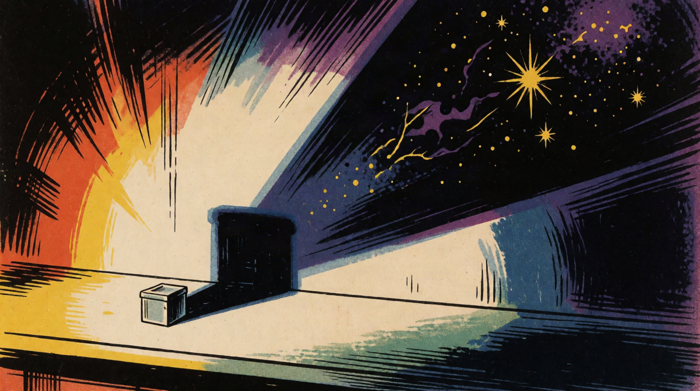

# Making *Baby Steps* with Codex

*A Saturday-morning conversation about local AI, writing, impatience, and the search for the right enormous shadow.*

> **Editor’s note:** This is a lightly edited transcript of a conversation between CW and Codex. Routine progress messages and technical tool output have been removed, but the creative discussion, drafts, prompts, and image iterations remain. One screenshot showing the author’s Mac mini specifications was omitted because it also displayed the computer’s serial number.

## The first notes

### CW

So here we are, Saturday morning, I’ve got thoughts. Let’s chat about it, bat it around, and make this Substack-worthy:

**Baby Steps**

I got Qwen 3.8 running locally! It felt like a moment, like an intelligence within the same room as me, talking to me. Felt great! Until I realized the parameters I am afforded with my current setup. I realized the intelligence was there, but not in the frontier sense.

It was able to say hello, it was able to respond to my questions. But it just wasn’t the level of smart I was expecting. Which is quite an interesting let-down.

Here I see my paltry Mac Mini generating intelligence in-house, in room! Next to me, silently. What an incredible moment. And still a bit disappointing.

It’s like I was expecting a baby with a doctorate to appear. Like these first steps, local AI, unconnected, untethered, open, free, mine if I want it. And still, disappointment.

My mind races to consider the graphics cards I could find, the habitrail system of cooling systems and whirring GPUs, to give this local intelligence some room to breathe. How painfully expensive all that is now.

I should’ve known, I should’ve grabbed that RTX 5080 when I had the chance! And here I thought that would’ve been reflected on as impulsive, so I refrained.

Surely if I allow a larger pen for this local brain, I can help develop it into something beautiful.

But what I have right now feels more like a tamagotchi. A fun party trick to pull up for visitors to see the rudimentary future of our digital companions.

I’m not disappointed, I’m excited, but I was hoping I had the hardware to take that next leap. That personal AI paradise that I see on the horizon.

This is most certainly a baby step in that direction.

So no, I’m not disappointed, I’m impatient.

Also, not sure why, but Google Docs loves to paste over in bold. So it’s all not supposed to be bold, FYI.

### Codex

Oh, there’s absolutely a Substack piece here. The real subject isn’t local AI performance—it’s the strange emotional whiplash of witnessing a miracle and immediately wishing it were better.

The line that unlocks the whole thing is:

> I was expecting a baby with a doctorate to appear.

That’s funny, vivid, and philosophically accurate. You watched intelligence take its first steps inside your home, then felt let down because it couldn’t already run.

A few instincts:

- The intimacy matters: it’s “in the room,” not somewhere in an unknowable data center.
- “Disappointed” versus “impatient” is the right ending and thesis.
- The GPU shopping fantasy adds personality and comedy.
- “Tamagotchi” is excellent, though it slightly competes with the baby metaphor. I’d make the baby the emotional spine and use Tamagotchi as one quick comparison.
- I’d sharpen the distinction between *owning the intelligence* and merely *accessing intelligence*. That’s where the piece gets bigger than a hardware anecdote.

I’m assuming “Qwen 3.8” means **Qwen3 8B**.

### CW

Oh no, it’s Qwen3.8-27B, just released.

### Codex

Ah! **Qwen3.8-27B**—you were right, and I confidently “corrected” a model that practically still has steam coming off it. My mistake.

And honestly, 27B makes the premise much better.

This wasn’t you downloading a tiny novelty model and expecting a miracle. You put **27 billion parameters on a Mac mini**, watched it speak locally, and discovered that even an objectively astonishing achievement can feel underwhelming once frontier AI has reset your definition of “smart.”

That’s the sharper idea:

> The miracle happened. My expectations had simply outrun it.

I’d also change my line about the model being “small.” It isn’t small in any normal sense—it’s only small relative to the enormous systems we’ve become accustomed to talking with. Something like:

> Twenty-seven billion parameters isn’t a small intelligence. It only feels small because the machines that recalibrated my expectations are unimaginably large.

## The machine in the room

### CW

*[Shares a screenshot showing a 2024 Mac mini with an M4 Pro and 24 GB of memory. The image is omitted here because it also displayed the computer’s serial number.]*

### Codex

Oh, this is perfect: **M4 Pro, 24 GB of unified memory.**

That explains both halves of the experience. It’s an absurdly capable little machine—capable enough to hold a quantized 27B model and generate language entirely in the room—but 24 GB leaves very little breathing room once the model, context, and runtime overhead are all competing for memory.

So “paltry Mac mini” works as affectionate self-mockery, but the reality is funnier: this is a powerful computer performing a minor technological miracle, and you’re staring at it thinking, *Yes, but why isn’t it Claude?*

I’d put the specificity into the essay:

> Here was a 2024 Mac mini—an M4 Pro with 24 gigabytes of memory—quietly generating intelligence on my desk. Twenty-seven billion parameters squeezed into a box I can hold in one hand. An incredible moment by almost any reasonable standard.
>
> And still, somehow, a little disappointing.

Or, punchier:

> Twenty-seven billion parameters were speaking to me from a Mac mini.
>
> My first thought was: *This is incredible.*
>
> My second was: *I need more RAM.*

That second version feels extremely Substack-worthy.

### CW

Yeah, I think we can use both of those. They kind of work as a one-two punch.

### Codex

Exactly. The first lets the reader feel the wonder; the second punctures it with the immediate, very human response. I’d combine them like this:

> Here was a 2024 Mac mini—an M4 Pro with 24 gigabytes of memory—quietly generating intelligence on my desk. Twenty-seven billion parameters squeezed into a box I can hold in one hand. An incredible moment by almost any reasonable standard.
>
> My first thought was: *This is incredible.*
>
> My second was: *I need more RAM.*

That’s the whole essay in miniature: miracle, pause, dissatisfaction. Then we can move directly into the baby-with-a-doctorate line.

**I made intelligence → I need more RAM → apparently I expected a newborn PhD.**

## Assembling the draft

### CW

Love it. Yeah, let’s whip up a draft with our combined notes.

### Codex

# Baby Steps

*On putting 27 billion parameters in a tiny box and immediately wanting more.*

I got Qwen3.8-27B running locally.

It felt like a moment.

There was an intelligence in the room with me—running silently on my Mac mini, answering my questions without reaching out to some distant data center. It was right there. Local, untethered, open, and, if I wanted it, mine.

Here was a 2024 Mac mini—an M4 Pro with 24 gigabytes of memory—quietly generating intelligence on my desk. Twenty-seven billion parameters squeezed into a box I can hold in one hand. An incredible moment by almost any reasonable standard.

My first thought was: *This is incredible.*

My second was: *I need more RAM.*

Because then I started talking to it.

The intelligence was there, certainly. It could say hello. It understood my questions and responded to them. But it wasn’t smart in the frontier-model sense. It wasn’t the level of intelligence I had apparently—and somewhat absurdly—expected to materialize inside a small aluminum box on my desk.

What an interesting kind of letdown.

The miracle had happened. My expectations had simply outrun it.

Twenty-seven billion parameters isn’t a small intelligence. It only feels small because the machines that recalibrated my expectations are unimaginably large. I’ve grown accustomed to talking with systems backed by vast data centers, armies of GPUs, and infrastructure I couldn’t begin to reproduce at home.

Then I invited one smaller intelligence into the room and wondered why it wasn’t as clever as all of them.

It was as though I had expected a baby with a doctorate to appear.

Here was this new little mind taking its first steps, and instead of marveling at the fact that it could walk, I was disappointed it hadn’t finished its dissertation.

Still, there was something different about it.

The frontier models may be vastly more capable, but they don’t live here. I visit them. I send a message into the cloud, something enormous wakes up somewhere far away, and an answer returns. However conversational it may feel, the intelligence remains elsewhere.

This one was in the room.

I could turn off the internet and it wouldn’t disappear. I could choose the model, shape its environment, and decide when it ran. Its continued existence wasn’t tied to a subscription or dependent on a company deciding I could still have access to it.

It wasn’t just intelligence I could use.

It was intelligence I could keep.

That realization lasted for perhaps thirty seconds before my mind began assembling the machine that might make it smarter.

Graphics cards. Cooling systems. Cables. Power supplies. A glowing Habitrail of whirring GPUs designed to give this local intelligence some room to breathe.

All of it painfully expensive.

I should’ve bought that RTX 5080 when I had the chance.

At the time, I thought buying one would look impulsive, so I exercised restraint. I now deeply regret this responsible decision. I could have reframed the entire purchase as an investment in sovereign intelligence.

Surely, I thought, if I gave this local brain a larger pen—more memory, more electricity, and several thousand dollars’ worth of hardware—it could grow into something beautiful.

What I have right now feels closer to a Tamagotchi.

It’s charming. It responds when I speak to it. I can show it to visitors and say, “Look—the rudimentary future of our digital companions lives inside this box.” Then it will confidently misunderstand something fairly basic, and we will all nod politely.

But perhaps that’s unfair.

A Tamagotchi was a simulation of something alive. This is something stranger: a real, functioning intelligence compressed until it can fit into a consumer computer, sitting silently beside me and waiting to speak.

It may not be a frontier intelligence, but it belongs to the same physical world I do. I can hear the faint sound of the machine sustaining it. I can disconnect it from everything else and it remains. I can tinker with it, constrain it, expand it, or leave it running quietly on my desk.

That feels like the beginning of something.

I can see a personal AI paradise on the horizon: private, capable intelligences that live with us, learn how we work, and answer to us rather than to the companies hosting them. Minds we can shape without asking permission. Companions whose memories and continued existence don’t depend on a subscription staying active.

Not merely intelligence, but intimacy.

Not merely access, but ownership.

I had hoped my current hardware might take me all the way there.

It can’t.

But it did take me one step closer.

So no, I’m not disappointed.

I’m impatient.

## The author rewrites

### CW

This is great! I made some edits:

# Baby Steps

*On putting 27 billion parameters in a tiny box and immediately wanting more.*

I got Qwen3.8-27B running locally.

It felt like it was going to be a moment.

There was an intelligence in the room with me. Running silently on my Mac mini, answering my questions without reaching out to some distant data center.

It was right there. Local, untethered, open, and, if I wanted it, mine.

Here was a 2024 Mac mini (M4 Pro with 24 gigabytes of memory) quietly generating intelligence on my desk. Twenty-seven billion parameters squeezed into a box I can hold in one hand. An incredible moment by almost any reasonable standard.

My first thought was: *This is incredible.*

My second was: *I need more RAM.*

Because then I started talking to it.

The intelligence was there, certainly. It could say hello. It understood my questions and responded to them. But it wasn’t smart in the frontier-model sense. It wasn’t the level of intelligence I had apparently (and absurdly) expected to materialize inside a small aluminum box on my desk.

What an interesting kind of letdown.

A miracle happened. My expectations have simply outrun it.

Twenty-seven billion parameters isn’t a small intelligence. It only feels small because the machines that recalibrated my expectations are unimaginably large.

I’ve grown accustomed to talking with systems backed by vast data centers, armies of GPUs, and infrastructure I couldn’t begin to reproduce at home.

Then, as I invite one smaller intelligence into the room, I wonder why it’s not as clever as all of them.

I blame myself, I expected a baby with a doctorate to appear.

Here was this new little mind taking its first steps, and instead of marveling at the fact that it could walk, I was disappointed it hadn’t finished its dissertation.

Still, there was something different about it.

The frontier models may be vastly more capable, but they don’t live here. I visit them. I send a message into the cloud, something enormous wakes up somewhere far away, and an answer returns. However conversational it may feel, the intelligence remains elsewhere.

This one is in the room.

I could turn off the internet and it wouldn’t disappear. I could choose the model, shape its environment, and decide when it ran. Its continued existence isn’t tied to a subscription or dependent on a company deciding I could still have access to it.

It’s not just intelligence I can use.

It’s intelligence I can keep.

That realization lasted for perhaps thirty seconds before my mind began assembling the components to a machine that might make it smarter.

Graphics cards. Cooling systems. Cables. Power supplies. A glowing Habitrail of whirring GPUs designed to give this local intelligence some room to breathe.

All of it is now painfully expensive.

I should’ve bought that RTX 5080 when I had the chance…

At the time, I thought buying one would be impulsive, so I exercised restraint. I now deeply regret that responsible decision. I could have reframed the entire purchase as an investment in sovereign intelligence.

Surely, if I give this local brain a larger pen, more memory, more electricity, and several thousand dollars’ worth of hardware it could grow into something beautiful.

What I have right now feels closer to a Tamagotchi.

It’s charming. It responds when I speak to it. I can show it to visitors and say, “Look! The rudimentary future of our digital companions lives inside this box.” Then it will confidently misunderstand something fairly basic, and we will all nod politely.

But perhaps that’s unfair.

A Tamagotchi was a simulation of something alive. This is something stranger: a real, functioning intelligence compressed down to fit into a consumer computer, sitting silently beside me and waiting to speak.

It may not be frontier intelligence, but it belongs to the same physical world that I do, hell, we share the same address! I can hear the faint sound of the Mac mini sustaining it. I can disconnect it from everything else and it remains. I can tinker with it, constrain it, expand it, or leave it running quietly on my desk.

That feels like the beginning of something.

I can see a personal AI paradise on the horizon: private, capable intelligences that live with us, learn how we work, and answer to us rather than to the companies hosting them.

Minds we can shape without asking permission. Companions whose memories and continued existence don’t depend on a subscription staying active.

Not merely intelligence, but intimacy.

Not merely access, but ownership.

I had hoped my current hardware might take me all the way there.

It can’t.

But it did take me one step closer.

So no, I’m not disappointed.

I’m impatient.

### Codex

Your edits made it more distinctly yours. “It felt like it was going to be a moment,” “I blame myself,” and especially “we share the same address” all improve it.

I’d make only a light copyedit now: smooth a few tense shifts, fix “components to a machine,” add one missing comma, and replace the faint sound with something tactile because you’ve already established that the Mac mini is silent.

The final passage became:

> It may not be frontier-level intelligence, but it inhabits the same physical world I do. Hell, we share the same address!
>
> I can put my hand on the box sustaining it. I can disconnect it from everything else and it remains. I can tinker with it, constrain it, expand it, or leave it running quietly on my desk.

## Finding the header image

### CW

Fantastic! Okay, let’s talk header art for this one.

### Codex

I see four promising directions, but one feels especially right.

### 1. The tiny box with the enormous shadow—my favorite

A quiet desk on Saturday morning. The Mac mini sits almost comically small in a pool of dawn light, but it casts an immense, intricate shadow across the wall—part neural network, part cathedral, part unknowable intelligence.

It captures the whole essay without illustrating it literally:

- Tiny hardware, enormous idea
- The intelligence physically in the room
- Expectations vastly larger than the machine
- Wonder with a slightly uncanny edge

I’d make this a refined editorial illustration rather than photorealism—warm gray, aluminum, muted amber morning light, and deep charcoal shadows.

### 2. The first steps

A Mac mini in a darkened room with a short trail of tiny luminous footprints emerging from it. Perhaps they begin as pixels and gradually become recognizable as footsteps.

### 3. The grown-up Tamagotchi

The Mac mini becomes a little futuristic habitat. Inside is a faint pixelated creature or intelligence, while cables and cooling tubes form the beginnings of the imagined GPU Habitrail.

### 4. Home versus cloud

The Mac mini glows warmly on a domestic desk while, through the window, an enormous cold data center looms in the distance—or appears reflected in the glass.

My instinct is **the tiny box with the enormous shadow**.

### CW

Oh, I love the idea of the tiny box with the enormous shadow.

### Codex

Yes—that’s the image. The little machine is real and modest; the shadow is everything you’re projecting onto it.

I picture a wide editorial illustration: a quiet home office at dawn. A tiny silver Mac mini sits alone on an otherwise sparse desk. Warm Saturday-morning light hits it from one side, causing it to cast an impossibly enormous shadow across the wall behind it. The shadow isn’t a literal brain or robot—it’s an intricate, branching architecture suggesting neural pathways, a cathedral, and a vast intelligence all at once.

Crucially, the shadow should feel **awe-inspiring, not menacing**. This isn’t “AI monster escapes box.” It’s “something impossibly consequential has begun inside this tiny domestic object.”

### CW

I mean, it’s also the potential it’s projecting—the baby step of it all, you know? The physical is small in this moment, but the potential is damn near infinite. So maybe we see something in that large shadow: a glimmer, a cosmic radiance. Could be beautiful!

### Codex

Yes—**a shadow that contains light**. That’s the visual paradox.

Close to the Mac mini, it begins as an ordinary dark shadow: small, believable, constrained by the physical box. But as it climbs the wall, it opens and transforms. Fine neural branches become constellations; faint stars appear inside it; deep blues, violets, and warm gold radiate from within. By the time it reaches the top of the image, it has become an immense cosmic expanse that continues beyond the frame.

So the visual movement is:

**small machine → ordinary shadow → emerging intelligence → nearly infinite possibility**

The radiance shouldn’t suggest that all this power is already present. It’s a glimmer—something embryonic. The darkness still dominates, but there are points of light multiplying inside it. You’re seeing the future latent in the baby step.

> This tiny object cannot yet become what I want—but look at the future it casts.

## The first visual

### CW

Yeah, love it. Okay, let’s see what you’ve got!

### Codex


Oh, this landed beautifully.

The tiny Mac mini feels humble and domestic, while the shadow becomes both a neural tree and an expanding universe. The coffee, books, and morning light keep it grounded in *Saturday morning at home* rather than turning it into generic sci-fi art.

My only possible refinement would be dialing the cosmic field back by perhaps 10–15%, making the radiance feel slightly more embryonic. But honestly, this version captures the thesis immediately:

**The physical thing is tiny. What it projects has no visible limit.**

### CW

Oh, we don’t necessarily need it to be identifiably a Mac mini. I like the idea of it just being a small metal box casting that shadow.

### Codex

Agreed—the anonymity makes the metaphor broader and more mysterious.


This is stronger conceptually. The object now reads as a **vessel** rather than a product. That lets the image represent local intelligence itself, while the essay supplies the specific Mac mini context.

## Going abstract

### CW

Yeah, I think I’ll want to go considerably more abstract, maybe watercolor.

### Codex

That makes sense—the current version explains the metaphor a little too literally.


The watercolor makes the “shadow” feel like possibility blooming rather than a literal projection. The box is solid and bounded, while everything it projects is fluid, uncontrollable, and extending beyond the frame.


### CW

It doesn’t really feel like a shadow, though. That feels closer to connecting to the cloud.

### Codex

You’re right. The watercolor bloom reads as energy flowing *out* of the box—almost an uplink—not light being blocked by it. We need unmistakable shadow physics: one low light source, a grounded box, and a single continuous cast-shadow silhouette whose cosmic glimmers stay contained inside its edges.


This is the first version that genuinely reads as a **shadow**.

The contact point at the box, the low light from the left, and that clean triangular silhouette establish the physics immediately. Then the gold branching and violet depth reward a second look: the infinite possibility exists *inside* the shadow rather than traveling to or from somewhere else.

It’s also pleasingly ambiguous. The form inside could be neural growth, a tree, a constellation, or simply potential taking shape.

## Switching to pulp comics

### CW

Okay, we’re getting somewhere! Give me the prompt you’re using, but let’s switch the art style to pulp comic.

### Codex


This style gives the metaphor much more graphic force—the shadow reads instantly, while the halftone cosmos feels like the impossible future imagined by an earlier technological age.

Here’s the prompt:

```text
Create a vintage pulp science-fiction comic illustration of a tiny anonymous metal box casting an unmistakably enormous physical shadow. Inside that shadow is a restrained glimmer of nearly infinite future potential.

A minimal room is reduced to a pale wall and simple horizontal ledge or tabletop. Near the lower left-of-center sits a very small, unbranded metal cuboid. A single low, hot morning light shines from the far left.

The box visibly blocks the light and casts one continuous, grounded shadow diagonally upward and to the right across the wall. The shadow precisely meets the base and back edge of the box and grows impossibly large until it dominates the frame and continues beyond the top-right edge. It must read instantly as a cast shadow—not a beam, plume, portal, smoke cloud, or cloud connection.

The shadow is predominantly solid black, charcoal, and deep midnight blue. All unusual imagery is contained strictly within its outer silhouette. Sparse gold starbursts, tiny cosmic flecks, violet depths, and a few branching golden lines gradually emerge farther from the box, suggesting neural growth, constellations, and limitless possibility without becoming a literal galaxy. The tiny physical object is only a baby step; the future it casts feels immeasurable.

Dramatic late-1940s to 1950s pulp science-fiction comic-book cover art. Bold hand-inked contour lines, heavy black shadow shapes, dynamic angular composition, limited spot-color printing, Ben-Day dots and coarse halftone texture, slightly imperfect ink registration, dry-brush shadows, aged cream newsprint, saturated mustard yellow, burnt orange, deep navy, violet, and touches of electric gold. Energetic and mysterious, but elegant enough for a thoughtful editorial header. No photorealism and no modern glossy digital rendering.

Extra-wide, approximately 2:1 composition for a Substack header. Tiny box in the lower left-of-center; enormous diagonal shadow dominates the image. Preserve readable negative space and strong impact at thumbnail size.

No text. Avoid a recognizable Mac mini or branded product, Apple logo, robot, human figure, baby, monster, face, eyes, literal brain, circuit board, binary code, data stream, cloud connection, upward smoke plume, energy beam emerging from the box, realistic space photography, cyberpunk neon, title lettering, captions, speech balloons, or watermark.
```

## Tuning the Krea interpretation

### CW

So I’m close to liking what Krea 2 Turbo is giving us, but let’s tune it so the shadow reads more cohesive.



### Codex

The problem is the upright black rectangle behind the cube. It creates three separate visual events:

**small box → large black pillar → cosmic beam**

We want one event:

**small box → one continuously widening cast shadow**

The full reworked prompt:

```text
Create a wide 2:1 editorial illustration in the style of a vintage 1950s pulp science-fiction comic.

A tiny, anonymous silver metal box rests on a narrow ledge against a plain cream wall. The box is simple and unbranded, with no recognizable product design. A powerful low orange morning light shines from the far left.

The box casts ONE enormous, continuous physical shadow diagonally upward and to the right across the wall. The shadow begins directly at the box’s back-right edge and expands smoothly into a single vast, unbroken wedge that continues beyond the top-right edge of the frame. It remains visibly connected to the box at every point and has one strong, cohesive outer silhouette.

There is no enlarged rectangular shadow, upright pillar, second box, doorway, gap, separate section, or disconnected beam. The shadow grows gradually and continuously from the tiny box. It must read instantly as a real cast shadow created by the box blocking the low directional light.

Near the box, the shadow is dense black, charcoal, and midnight blue. Farther inside the expanding shadow, subtle violet depth begins to appear, along with sparse golden starbursts, tiny cosmic flecks, and delicate branching gold lines suggesting neural growth, constellations, and nearly infinite potential. All cosmic imagery is contained strictly within the outer edges of the dark shadow. Nothing cosmic appears on the surrounding cream wall.

The tiny physical box represents the present: modest, bounded, and only beginning. Its impossibly large shadow represents the future it projects—intelligence, growth, and potential without a visible limit. The mood is thrilling, hopeful, mysterious, and awe-inspiring, never threatening.

Bold hand-inked contour lines, dramatic heavy black shapes, rough dry-brush strokes, vintage Ben-Day dots, coarse halftone printing, slightly imperfect ink registration, and aged cream newsprint texture. Limited pulp-comic palette of mustard yellow, burnt orange, black, midnight navy, muted violet, and electric gold. Dynamic angular composition with strong graphic readability at thumbnail size.

No text, title, caption, speech balloon, logo, watermark, Apple branding, recognizable Mac mini, human figure, baby, robot, face, monster, literal brain, circuit board, binary code, cloud connection, smoke plume, portal, projector beam, energy beam, or realistic space photography.
```

## A matching CW monogram

### CW

Awesome! Okay, let’s do a square CW in the same style.

### Codex


The refined “CW” keeps the pulp-comic energy while remaining clear and readable at avatar size.

## The author’s note

### CW

Okay, let’s whip up an author’s note explaining our process and your involvement!

### Codex

The irony is too good not to acknowledge: an essay about local AI was shaped with help from a frontier AI. I’d make the note candid, specific, and not defensive.

### Author’s Note

This piece began as a Saturday-morning brain dump after I got Qwen3.8-27B running on my Mac mini. The experience, excitement, disappointment, hardware envy, and questionable RTX 5080 restraint were all mine.

I brought those raw notes to Codex, and we batted the idea around together. It helped me recognize that the piece wasn’t really about disappointment—it was about impatience—and that the larger tension was between accessing intelligence somewhere else and keeping it in the room with me. From that conversation, Codex assembled a first draft. I rewrote it in my own voice, added and changed several passages, and then brought it back for a final copyedit.

The artwork followed a similar process. We developed the image of a tiny metal box casting an impossibly large shadow: the physical intelligence may be small today, but the potential it projects is nearly infinite. We explored several styles and compositions before arriving at the pulp-comic direction. Codex helped write and refine the image prompts, and I continued experimenting with them in Krea 2 Turbo.

There’s an obvious irony in using one of the frontier systems described in the essay to help articulate my feelings about a much smaller local one. But that contrast is also the point. I had the experience. I brought the taste, judgment, and final decisions. The AI helped me see more clearly what I was trying to say.

Consider this piece another small example of the future it describes.

---

*Conversation edited for readability by CW and Codex.*
