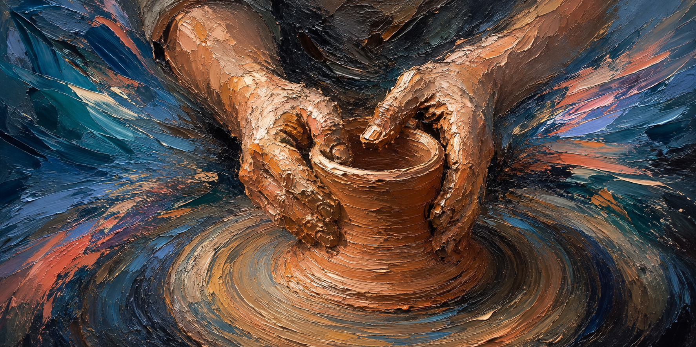
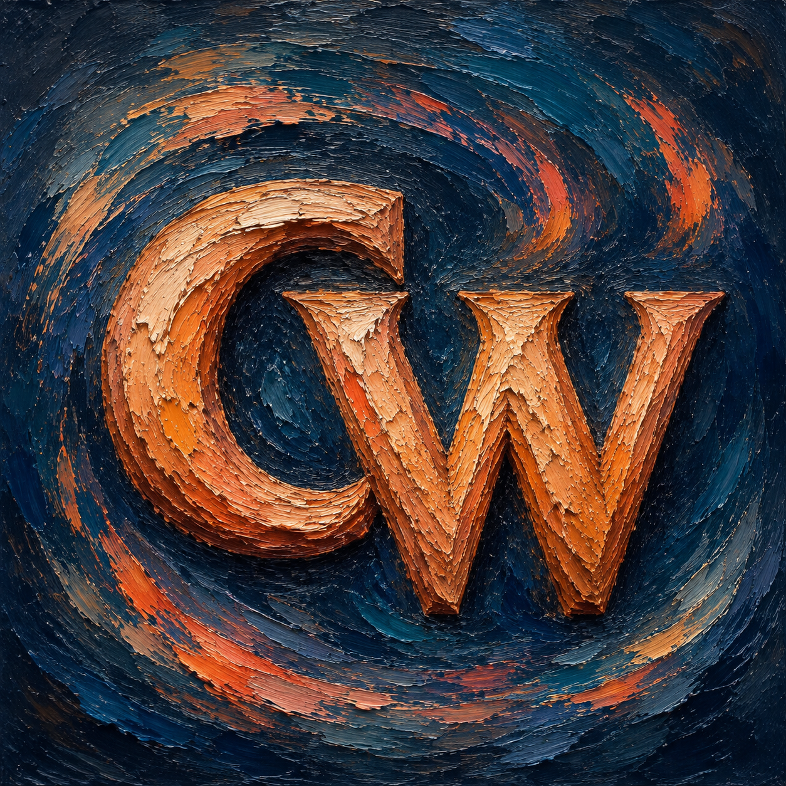

# Making *Strap in* with Codex

> **Editor’s note:** This transcript preserves the user and assistant discussion, draft revisions, image prompts, and generated artwork through the author’s note. Routine progress messages, internal instructions, and technical tool output are omitted. Writing-block wrappers have been removed, and the pasted text attachment is expanded in place. Chapter headings are editorial additions.

## The coin flip and the first draft

### CW

hey there! Saturday morning again. I've got a draft of my thoughts, and you won the coin flip. It was between you and Fable 5.1, it's shocking there's two new models the next week after the first time I did a coin flip decision between models. Anyway, here's my draft. Let's chat about it:
[https://docs.google.com/document/d/1qxaZbyfTgeGWbvBEcSrQNCxGRg3FVSXMIJNsHjGAVS8/edit?usp=sharing](https://docs.google.com/document/d/1qxaZbyfTgeGWbvBEcSrQNCxGRg3FVSXMIJNsHjGAVS8/edit?usp=sharing)

Strap in
Welcome to the everything era.

New models this week. Fable 5.1 and GPT-6 Astra. Both are fantastic, both are step changes, both usher in a new era of wonder, understanding and fear.

Yes we’re taking larger steps towards a present moment where we can cure cancer, solve conflicts, feed, clothe and house the world. Oh, and also, if we choose, create another world-halting pandemic.

So yeah, we’ve got some choices before us. Each of us. Individually and collectively.

Bernie Sanders is opting for an immediate pause, threatening an astounding 20 years in prison for folks working on artificial intelligence deemed superior to humans.

Shockingly the legendary Vermont senator is taking the fear route. And I do partly understand it. He fights for the little guy. It’s just a shame that he considers them incapable of wielding the thanos glove of AI.

I feel bad about this obviously. I love Bernie. I dream of a world where Al Gore won in 2000 and Bernie won in 2016. Or, I guess dreamt of it. Because now I know the path forward is paved with synthetic intelligence alongside emotionally-driven intent. Now see how I left that door open?

What does it mean to operate super intelligence with emotionally-driven intent? Well, it means everything, louder, faster and increasingly disruptive.

This is why I’ve spent many years focusing on my inner world. Reliving, resurfacing and resolving the wounds that gravitationally altered the foundations of my decisions.

I walk the narrower path now. I see a beautiful future, but I do not deny the widening area of casualty-stricken wasteland that surrounds that narrower path.

This moment, this acceleration is affording us a clear view of the awful that falls away in time. The other choices, and their aftermath. The pandemics, the biological monstrosities. The robocops and the star warses. It’s all in the cards, and since gravity only works so fast, our speed in intent to outcome will allow us a painfully close view of those other choices.

So I understand Bernie wanting to try and prevent that. Or at least slow the change so its less obviously painful for everyone. But I have to disagree, I think this is the mercy of the moment. The speed of change will allow us to see the clarity of our own direction. Less confusion on our next footfall on the path forward.

We’re just required to witness the others. Watch the tyrants wield the power they always wished to apply. Watch the frustrated lash out in larger, more damaging ways. 

I don’t think this next phase is going to be all that joyous, but I’m confident there will be moments of beauty.

And I will do everything in my ability to create as many of those moments as possible.

Join me, shall you?

### Codex

Morning! Glad the coin landed here. “Welcome to the everything era” is a strong opening, but the sentence that interests me most is **“I think this is the mercy of the moment.”** That’s where this becomes your particular argument, and where I want to push a little.

I read your underlying thought as: when the distance between intent and outcome collapses, the condition of our inner lives becomes consequential in a new way. Wounds that once shaped someone’s relationships or decisions can now act through much more powerful tools. That makes the paragraph about your own inner work central. It gives the reader a reason to understand healing as part of preparing for power.

But there’s a gap between **faster consequences make our direction clearer** and **that clarity helps us change direction in time**. Sometimes a consequence teaches us something we can use on the next attempt. Sometimes it removes the possibility of another attempt. Your pandemic example puts that distinction right inside the essay. I can follow the claim that acceleration exposes us to ourselves; I need more to follow the claim that this exposure is merciful.

That’s also why “We’re just required to witness the others” catches me. Do you mean witness other people’s choices and their consequences? As written, it risks placing you and the reader on the narrow path, watching casualties happen elsewhere. Yet those consequences can reach people who chose carefully, too. The ending’s promise to create beauty feels more compelling if it includes responsibility toward those people.

On Bernie, the twenty-year maximum is in his announcement, specifically for violating or circumventing the proposed pauses and prohibitions. His stated rationale includes human control and concentrated corporate power. Saying he considers ordinary people incapable of wielding AI assigns him a belief the announcement doesn’t establish. You can disagree sharply while meeting that stronger version of his argument. [Sanders’s announcement](https://www.sanders.senate.gov/press-releases/news-sanders-casar-introduce-legislation-to-ban-artificial-superintelligence-and-temporarily-pause-advanced-ai-development/)

The question I’d start our conversation with is: **when you call this moment merciful, do you mean acceleration will help us become wiser—or that it will make our choices unmistakable, even when we fail to become wiser?** Those lead to quite different essays, and I’m curious which is closer to what you’re feeling.

### CW

yeah good catch, I think the mercy of the moment is the rapid acceleration of intent to outcome. So, it almost feels like things are going so fast that they're going in slow motion, you know? like so much of what we thought would destroy all society are already kinda actively happening. And it's all happening so quickly we can't react the same way we would. Also, interestingly it's the 25th anniversary of 9/11, which is its own can of worms but a relative moment where the loss of 3,000+ souls felt dramatically more meaningful than witnessing the broadscale destruction of a war started by ego

### Codex

Yeah, that helps me understand the slow-motion feeling. You’re describing events moving faster than our usual process of shock, interpretation, and response can keep up. And within that, you feel able to see the connection between an impulse and what it produces more directly.

The 9/11 comparison brings in another dimension: **the scale of suffering and the scale of our emotional response can be wildly different.** “Meaningful” is a tricky word there—I hear you describing how intensely a loss registered in collective consciousness, rather than how much those lives mattered relative to people killed in war. That distinction deserves to be explicit.

But this gives your “mercy” two possible meanings that I’d want to keep separate. One is that we can see our intentions become consequences quickly enough to recognize something about ourselves. The other is that events overwhelm our capacity to react, so we experience less of the shock we otherwise would. That second experience could be numbness. It might also leave less room for grief, resistance, or intervention.

What interests me is the possibility that you’re experiencing **greater clarity and less capacity to process what you see at the same time**. That feels closer to the tension you’re describing than the draft’s confidence about our next footfall.

When you say we can’t react the way we would, does that feel like freedom from the old fear response—or like there’s no longer enough time to feel the full weight of anything?

### CW

yeah maybe that's the thing, the demand for a response requires me to react faster than I'd prefer to react. So, like the pendulum is swinging so fast that it just looks like a blur, but if you train your eye you can kinda make it seem like it's sitting still. like a helicopter blade when it hits that right ratio of a camera shutter and it looks like the blade isn't moving. Then it's just all about saying to yourself: Where do I want that pendulum to sit? and focus on the blur in that spot to make it feel real enough. Like real enough for at least that next step

### Codex

Ah, now I understand why the inner work belongs in this essay. The demand for a response arrives before you’ve had the time you want to process it. Having spent years examining what drives your decisions gives you somewhere to place your attention when that happens.

“Real enough for at least that next step” feels much more precise than the draft’s “less confusion.” You can still be confused, grieving, overwhelmed—and have enough orientation to choose your next action. You don’t need the whole beautiful future to feel certain.

The helicopter image also contains a useful caution: the blade looks still, but it’s still moving. Focusing on the point you want doesn’t settle the world there. It can steady you enough to act toward it. **Your attention gives you a place to act from; your action is how you try to make that place real.**

That changes how I hear “mercy.” Perhaps it’s the shorter distance between choosing something and getting to participate in its existence. The destructive possibilities are overwhelming, but your ability to make a moment of beauty may also be closer at hand.

Is that last part true to your experience—the speed lets you *create* sooner, as well as demanding that you respond sooner?

### CW

yes, yeah like my creative engine is giving me the stability enough to throw more clay on the wheel as the world goes to shit

### Codex

There it is. **“My creative engine is giving me the stability to throw more clay on the wheel as the world goes to shit.”** That sentence gives me a way into the essay that “the mercy of the moment” alone didn’t.

Creating gives you enough stability to keep creating. And acceleration means more of what you imagine becomes something you can actually work with—clay on the wheel, something your hands can respond to. There’s a feedback loop here that helps explain the almost-still feeling inside all that speed.

It also brings the essay back within the reach of your own experience. “The speed of change will allow us to see the clarity of our own direction” makes a promise for everyone. What you’ve just said is personal, concrete, and easier to trust: this is how you’re finding your footing, and what you intend to do with it.

I’d bring that clay sentence into the draft, probably close to the ending. It gives “Join me” something tangible to mean. We can make things together while we’re frightened. We can give each other something beautiful to encounter. And making those things can help us stay steady enough to do it again.

## Weaving the draft

### CW

I love it, ok let's synthesize a draft that weaves this all together

### Codex

# Strap in

Welcome to the everything era.

New models this week. Fable 5.1 and GPT-6 Astra. Both have left me with that increasingly familiar combination of wonder, understanding and fear.

The distance between what we can imagine and what we can make is getting shorter. That includes our dreams of curing cancer, resolving conflicts, feeding, clothing and housing the world.

It also includes our nightmares.

So yeah, we’ve got some choices before us. Each of us. Individually and collectively.

Bernie Sanders is calling for an immediate pause on advanced AI development and a ban on artificial superintelligence, with penalties of up to twenty years in prison for violating the proposed restrictions.

I understand the impulse. He fights for the little guy, and there are very good reasons to question what happens when this much power is concentrated in so few hands.

I love Bernie. I dream of a world where Al Gore won in 2000 and Bernie won in 2016. Or, I guess, dreamt of it. These days I spend more time thinking about what we can make from here.

And increasingly, that means synthetic intelligence alongside emotionally-driven intent.

Now see how I left that door open?

What does it mean to operate extraordinary intelligence with emotionally-driven intent?

Well, it means everything, louder, faster and increasingly disruptive. Including whatever we haven’t worked through.

This is why I’ve spent so many years focusing on my inner world. Reliving, resurfacing and resolving the wounds that gravitationally altered the foundations of my decisions.

I still get scared. I still get angry. But I’m getting better at noticing what’s reaching for the controls.

That matters when the distance from impulse to consequence keeps shrinking.

Lately, things feel like they’re moving so fast they’re almost moving in slow motion. The demand for a response arrives before I’ve had the time I’d prefer to decide how to respond. Meanwhile, things we once spoke about as society-ending possibilities become things we’re somehow expected to absorb into an ordinary week.

The pendulum is swinging so quickly it looks like a blur.

You know when a camera catches a helicopter blade at just the right interval, and it looks like it’s sitting still?

That’s close to the feeling. Except the blade is still moving. The danger hasn’t stopped because I’ve found a way to look at it.

And I don’t want to mistake getting accustomed to horror for understanding it.

As we approach the twenty-fifth anniversary of 9/11, I keep thinking about how differently suffering registers. The loss of nearly three thousand people tore through our collective consciousness. The vast suffering of the wars that followed occupied a different place in our attention.

The lives mattered equally. Our attention did not hold them equally.

There’s something in that gap I don’t want to lose sight of now. Being unable to feel the full weight of everything doesn’t make any of it weightless.

So when I call this the mercy of the moment, I’m trying to name something very particular.

The distance between my own intent and what I can create is shrinking, too.

I can ask myself: Where do I want that pendulum to sit? What do I want to help exist?

Then I can focus on that place long enough to take a step toward it.

Real enough for at least that next step.

My creative engine is giving me the stability to throw more clay on the wheel as the world goes to shit.

I make something. It gives me something to work with. I adjust. Sometimes someone else finds something in it that helps them, and that gives me enough footing to try again.

This is where the speed becomes useful to me. I can reach an idea while I still feel it. Give it a shape. Discover what happens when it leaves my head and enters the world.

I understand Bernie wanting to slow things down. I share his concern about who gets hurt and who gets to choose. I also feel the possibilities opening in my own hands, and I want more people to have access to them.

I don’t know how much we’ll get right.

I see a beautiful future, and I see how much harm we’re capable of doing on the way there. None of us gets a private path beyond the reach of other people’s choices. The work includes caring for each other when those choices land.

I don’t think this next phase is going to be all that joyous. But I’m confident there will be moments of beauty.

And I will do everything in my ability to create as many of those moments as possible.

More clay on the wheel.

Join me, shall you?

## Witnessing and finding footing

### CW

ok love it! here are my edits, let's talk:


# Strap in

Welcome to the everything era.

New models this week. Fable 5.1 and GPT-6 Astra. Both have left me with that increasingly familiar combination of wonder, understanding and fear.

The distance between what we can imagine and what we can make is getting shorter. That includes our dreams of curing cancer, resolving conflicts, feeding, clothing and housing the world.

It also includes our nightmares.

So yeah, we’ve got some choices before us. Each of us. Individually and collectively.

Bernie Sanders is calling for an immediate pause on advanced AI development and a ban on artificial superintelligence, with penalties of up to twenty years in prison for violating the proposed restrictions.

I understand the impulse. He fights for the little guy, and there are very good reasons to question what happens when this much power is concentrated in so few hands.

I love Bernie. I dream of a world where Al Gore won in 2000 and Bernie won in 2016. Or, I guess, dreamt of it. These days I spend more time thinking about what we can make from here.

And increasingly, that means synthetic intelligence alongside emotionally-driven intent.

But what does it mean to operate extraordinary intelligence with emotionally-driven intent?

Well, it means everything happening louder, faster with increasingly disruptive outcomes. And those outcomes will Include whatever we haven’t worked through.

This is why I’ve spent so many years focusing on my inner world. Reliving, resurfacing and resolving the wounds that gravitationally altered the foundations of my decisions.

I still get scared. I still get angry. But I’m getting better at noticing what’s reaching for the controls in those moments.

That matters when the distance from impulse to consequence keeps shrinking.

Lately, things feel like they’re moving so fast they’re almost moving in slow motion. The demand for a response arrives before I’ve had the time I’d prefer to decide how to respond. 

Meanwhile, things we once spoke about as society-ending possibilities become things we’re somehow expected to absorb into an ordinary week.

The pendulum is swinging so quickly it looks like a blur.

You know when a camera catches a helicopter blade at just the right interval, and it looks like it’s sitting still?

That’s close to the feeling. Except the blade is still moving. The danger hasn’t stopped because I’ve found a way to look at it.

And I don’t want to mistake getting accustomed to horror for understanding it.

As we approach the twenty-fifth anniversary of 9/11, I keep thinking about how differently suffering registers. The loss of nearly three thousand people tore through our collective consciousness. The vast suffering of the wars that followed occupied a different place in our attention.

These lives matter equally. Our attention just can’t hold them equally.

There’s something in that gap I don’t want to lose sight of now. Being unable to feel the full weight of everything doesn’t make any of it weightless.

So when I call speed *the mercy of the moment*, I’m trying to name something very particular.

The distance between my own intent and what I can create is shrinking, too.

I can ask myself: Where do I want that pendulum to sit? What do I want to help exist?

Then I can focus on that place long enough to take a step toward it.

Real enough for at least that next step.

I just train my eye like it were a camera filming a spinning helicopter blade. I see it, plain as day, it’s right there. And I step forward.

My creative engine is giving me the stability to throw more clay on the wheel as the world goes to shit.

I make something. It gives me something to work with. I adjust. Sometimes someone else finds something in it that helps them, and that gives me enough signal to shift my weight forward..

This is where speed can become useful to me. I can reach an idea while I still feel it. Give it a shape. Discover what happens when it leaves my head and enters the world.

I understand Bernie wanting to slow things down. I share his concern about who gets hurt and who gets to choose. I also feel the possibilities opening in my own hands, and I want more people to have access to them.

I don’t know how much we’ll get right.

I see a beautiful future, and I see how much harm we’re capable of doing on the way there. 

None of us gets a private path beyond the reach of other people’s choices. The work includes caring for each other when those choices land as well.

I don’t think this next phase is going to be all that joyous. But I’m confident there will be moments of beauty.

And I will do everything in my ability to create as many of those moments as possible.

Just gotta throw more clay on the wheel.

Join me, shall you?

### Codex

Your edits make the movement feel more physical: noticing what’s reaching for the controls, finding a signal, shifting your weight, throwing more clay. That helps the piece explain how you actually move through uncertainty. “Enough signal to shift my weight forward” is especially good—you haven’t established certainty; you’ve found enough to commit a little more of yourself.

Two changes are worth talking through.

**“Our attention just can’t hold them equally” changes the argument.** “Did not” described what happened; “can’t” says we lack the capacity. There’s truth in our limited capacity to absorb suffering, but unequal attention also comes from proximity, identification, media coverage, and political choices. “Just can’t” risks excusing that whole mixture as inevitable. Do you want this line to express compassion for our limits, frustration with our selective attention, or some of both? I hear both in the surrounding paragraphs.

**The second helicopter passage gives your vision more certainty than the rest of the essay does.** “Real enough for at least that next step” leaves room for discovery. Then “plain as day, it’s right there” sounds like you can already see the destination clearly. And because you’ve explicitly reminded us that the blade remains dangerous, “I step forward” briefly makes me picture stepping into it.

I think the thing you’re reaching for there is worth keeping: you can deliberately train your attention toward a possibility until you can act on it. I’d make *the possibility* the thing you see, so the image doesn’t accidentally suggest that you’ve mistaken the optical illusion for safety.

The clay paragraph holds all of this together because it includes correction: **“I make something. It gives me something to work with. I adjust.”** That’s what makes your hope persuasive to me. You’re willing to let what happens inform the next move. I’d protect that openness wherever another line starts sounding too certain.

And “Just gotta throw more clay on the wheel” sounds like you talking after taking a long breath. It brings the ending back down to something you can do today.

Tiny cleanup whenever you’re ready: lowercase “include,” remove the doubled period after “forward,” and consider “louder, faster, and with increasingly disruptive outcomes” for the rhythm.

### CW

wow, yeah, astute, and I agree I'm frustrated with our selective attention, and the avenues in which we can even participate in witnessing the realities of the world, but also thankful that a witnessing bankruptcy is a viable self preservation statement these days. And I agree I don't want to confuse the optical illusion for safety, the danger is still real, but we must keep moving and the choice matters, thankfully I've still found terra firma on each shuffle forward

### Codex

“Witnessing bankruptcy” names something that “our attention just can’t hold them equally” leaves out: **you can care and still have nothing left to spend.** You’re frustrated by whose suffering becomes visible, through which channels, and with what opportunities to respond. You’re also grateful you can admit you’ve reached capacity. Those feelings belong together here.

I’d give that tension a little room:

> These lives matter equally. Our attention doesn’t hold them equally. I’m frustrated by whose suffering reaches us, and how little room we sometimes have to respond when it does. I’m also thankful we can admit when we have nothing left to give to the witnessing. Some days I reach a kind of witnessing bankruptcy. I still care. I need to look away.

Then your existing “Being unable to feel the full weight of everything doesn’t make any of it weightless” has more behind it.

And **“thankfully I’ve still found terra firma on each shuffle forward”** resolves the helicopter passage beautifully. It’s a statement about your experience so far. The gratitude matters: you’re finding footing, testing it, discovering that it holds.

I’d replace the second helicopter passage with something close to your own words:

> The danger is still real. I focus on what I want to help exist, and shuffle toward it. Thankfully, so far, I’ve found terra firma under each step. Enough footing to make something, see what happens, and choose again.

That leads naturally into the clay. It also gives “the choice matters” a practical meaning: each step changes where you stand and what you can do next.

### CW

can you weave that in and fix up those little typo errors that you spotted?

### Codex

# Strap in

Welcome to the everything era.

New models this week. Fable 5.1 and GPT-6 Astra. Both have left me with that increasingly familiar combination of wonder, understanding and fear.

The distance between what we can imagine and what we can make is getting shorter. That includes our dreams of curing cancer, resolving conflicts, feeding, clothing and housing the world.

It also includes our nightmares.

So yeah, we’ve got some choices before us. Each of us. Individually and collectively.

Bernie Sanders is calling for an immediate pause on advanced AI development and a ban on artificial superintelligence, with penalties of up to twenty years in prison for violating the proposed restrictions.

I understand the impulse. He fights for the little guy, and there are very good reasons to question what happens when this much power is concentrated in so few hands.

I love Bernie. I dream of a world where Al Gore won in 2000 and Bernie won in 2016. Or, I guess, dreamt of it. These days I spend more time thinking about what we can make from here.

And increasingly, that means synthetic intelligence alongside emotionally-driven intent.

But what does it mean to operate extraordinary intelligence with emotionally-driven intent?

Well, it means everything happening louder, faster, and with increasingly disruptive outcomes. And those outcomes will include whatever we haven’t worked through.

This is why I’ve spent so many years focusing on my inner world. Reliving, resurfacing and resolving the wounds that gravitationally altered the foundations of my decisions.

I still get scared. I still get angry. But I’m getting better at noticing what’s reaching for the controls in those moments.

That matters when the distance from impulse to consequence keeps shrinking.

Lately, things feel like they’re moving so fast they’re almost moving in slow motion. The demand for a response arrives before I’ve had the time I’d prefer to decide how to respond.

Meanwhile, things we once spoke about as society-ending possibilities become things we’re somehow expected to absorb into an ordinary week.

The pendulum is swinging so quickly it looks like a blur.

You know when a camera catches a helicopter blade at just the right interval, and it looks like it’s sitting still?

That’s close to the feeling. Except the blade is still moving. The danger hasn’t stopped because I’ve found a way to look at it.

And I don’t want to mistake getting accustomed to horror for understanding it.

As we approach the twenty-fifth anniversary of 9/11, I keep thinking about how differently suffering registers. The loss of nearly three thousand people tore through our collective consciousness. The vast suffering of the wars that followed occupied a different place in our attention.

These lives matter equally. Our attention doesn’t hold them equally.

I’m frustrated by whose suffering reaches us, how it reaches us, and how little room we sometimes have to respond when it does. I’m also thankful we can admit when we have nothing left to give to the witnessing.

Some days I reach a kind of witnessing bankruptcy. I still care. I need to look away.

There’s something in that gap I don’t want to lose sight of now. Being unable to feel the full weight of everything doesn’t make any of it weightless.

So when I call speed *the mercy of the moment*, I’m trying to name something very particular.

The distance between my own intent and what I can create is shrinking, too.

I can ask myself: Where do I want that pendulum to sit? What do I want to help exist?

Then I can focus on that place long enough to take a step toward it.

Real enough for at least that next step.

The danger is still real. We have to keep moving, and the choice of where matters. I focus on what I want to help exist, and shuffle toward it.

Thankfully, so far, I’ve found terra firma under each step. Enough footing to make something, see what happens, and choose again.

My creative engine is giving me the stability to throw more clay on the wheel as the world goes to shit.

I make something. It gives me something to work with. I adjust. Sometimes someone else finds something in it that helps them, and that gives me enough signal to shift my weight forward.

This is where speed can become useful to me. I can reach an idea while I still feel it. Give it a shape. Discover what happens when it leaves my head and enters the world.

I understand Bernie wanting to slow things down. I share his concern about who gets hurt and who gets to choose. I also feel the possibilities opening in my own hands, and I want more people to have access to them.

I don’t know how much we’ll get right.

I see a beautiful future, and I see how much harm we’re capable of doing on the way there.

None of us gets a private path beyond the reach of other people’s choices. The work includes caring for each other when those choices land as well.

I don’t think this next phase is going to be all that joyous. But I’m confident there will be moments of beauty.

And I will do everything in my ability to create as many of those moments as possible.

Just gotta throw more clay on the wheel.

Join me, shall you?

### CW

ok cool, made a few tweaks:

Strap in

Welcome to the everything era.

New models this week. Fable 5.1 and GPT-6 Astra. Both have left me with that increasingly familiar combination of wonder, understanding and fear.

The distance between what we can imagine and what we can make is getting shorter. That includes our dreams of curing cancer, resolving conflicts, feeding, clothing and housing the world.

It also includes our nightmares.

So yeah, we’ve got some choices before us. Each of us. Individually and collectively.

Bernie Sanders is calling for an immediate pause on advanced AI development and a ban on artificial superintelligence, with penalties of up to twenty years in prison for violating the proposed restrictions.

I understand the impulse. He fights for the little guy, and there are very good reasons to question what happens when this much power is concentrated in so few hands.

I love Bernie. I dream of a world where Al Gore won in 2000 and Bernie won in 2016. Or, I guess, dreamt of it. These days I spend more time thinking about what we can make from here.

And increasingly, that means synthetic intelligence alongside emotionally-driven intent.

But what does it mean to operate extraordinary intelligence with emotionally-driven intent?

Well, it means everything happening louder, faster, and with increasingly disruptive outcomes. And those outcomes will include whatever we haven’t worked through.

This is why I’ve spent so many years focusing on my inner world. Reliving, resurfacing and resolving the wounds that gravitationally altered the foundations of my decisions.

I still get scared. I still get angry. But I’m getting better at noticing what’s reaching for the controls in those moments.

That matters when the distance from impulse to consequence keeps shrinking.

Lately, things feel like they’re moving so fast they’re almost moving in slow motion. The demand for a response arrives before I’ve had the time I’d prefer to decide how to respond.

Meanwhile, things we once spoke about as society-ending possibilities become things we’re somehow expected to absorb into an ordinary week.

The pendulum is swinging so quickly it looks like a blur.

You know when a camera catches a helicopter blade at just the right interval, and it looks like it’s sitting still?

That’s close to the feeling. Except the blade is still moving. The danger hasn’t stopped because I’ve found a way to look at it.

And I don’t want to mistake getting accustomed to horror for understanding it.

As we approach the twenty-fifth anniversary of 9/11, I keep thinking about how differently suffering registers. The loss of nearly three thousand people tore through our collective consciousness. The vast suffering of the wars that followed occupied a different place in our attention.

These lives matter equally. Our attention doesn’t hold them equally.

I’m frustrated by whose suffering reaches us, how it reaches us, and how little room we sometimes have to respond when it does. I’m also thankful we can admit when we have nothing left to give to the witnessing.

Some days I reach a kind of witnessing bankruptcy. I still care. I just need to look away.

There’s something in that gap I don’t want to lose sight of now. Being unable to feel the full weight of everything doesn’t make any of it weightless.

So when I call speed the mercy of the moment, I’m trying to name something very particular.

Because I also notice the distance between my own intent and what I can create is shrinking, too.

I can ask myself: Where do I want that pendulum to sit? What do I want to help exist?

Then I can focus on that place long enough to take a step toward it.

Real enough for at least that next step.

The danger is still real. We have to keep moving, and the choice of where we move matters. I focus on what I want to help exist, and shuffle toward it.

Thankfully, so far, I’ve found terra firma under each step. Enough footing to make something, see what happens, and choose again.

My creative engine is giving me the stability to throw more clay on the wheel as the world goes to shit.

I make something. It gives me something to work with. I adjust. Sometimes someone else finds something in it that helps them, and that gives me enough signal to shift my weight forward.

This is where speed can become useful to me. I can reach an idea while I still feel it. Give it a shape. Discover what happens when it leaves my head and enters the world.

I understand Bernie wanting to slow things down. And I share his concern about who gets hurt and who gets to choose. I also feel the possibilities opening in my own hands, and I want more people to have access, fluency and (hopefully) excitement.

I don’t know how much we’ll get right.

I see a beautiful future, and I see how much harm we’re capable of doing on the way there.

None of us gets a private path beyond the reach of other people’s choices. The work includes caring for each other when those choices land as well.

I don’t think this next phase is going to be all that joyous. But I’m confident there will be moments of beauty.

And I will do everything in my ability to create as many of those moments as possible.

Just gotta throw more clay on the wheel.

Join me, shall you?

### Codex

The addition of **“access, fluency and (hopefully) excitement”** does useful work. It makes your wish for other people more specific: you want them to have the tools, feel capable of using them, and perhaps find some of the creative possibility you’re finding. “Hopefully” leaves room for their experience to differ from yours.

“I still care. I **just** need to look away” also sounds more spoken and vulnerable. I’d keep it.

The only sentence I’d smooth is:

> Because I also notice the distance between my own intent and what I can create is shrinking, too.

“Also” and “too” repeat each other, and “Because” makes the transition slightly tangled. A small adjustment preserves your emphasis on noticing:

> I notice it in my own life: the distance between my intent and what I can create is shrinking, too.

Otherwise, I’d let this stand. The essay now earns its ending through your experience of making, adjusting, and finding footing. “Just gotta throw more clay on the wheel” feels like a practice you’re inviting us into.

## More clay: the artwork

### CW

love it! ok let's talk header art

### Codex

My vote is **a pottery wheel with a sharply focused center and a world blurring around it**.

Close view of hands shaping wet clay. The vessel is unfinished, slightly uneven, alive with possibility. Warm light on the hands and clay; beyond them, a cooler background stretched into motion. The wheel and the world are both spinning, but there’s enough steadiness here to make something.

I’d keep the surrounding turmoil abstract. Literal flames or ruined cities would overpower the more interesting feeling: *I can still create inside this.*

Two other directions could work:

- **The next foothold:** A foot finding a small patch of solid earth amid blurred surroundings. More tentative and quiet; emphasizes “terra firma.”
- **The everything era:** A clay vessel whose unfinished rim opens into a rush of possible forms—buildings, plants, strange inventions. More exuberant; emphasizes possibility, but risks getting busy.

The pottery wheel feels most yours because it carries both the motion and the response. I’m picturing a wide, painterly image with tactile clay and enough photographic detail to feel physical. No text baked in.

Does that feel right, or are you imagining something more surreal or graphic?

### CW

yeah I love the pottery idea, I think we could have a lot of fun with the art style

### Codex

Yes—the clay gives us permission to make the image itself feel handmade. A few directions I’d enjoy:

- **Thick oil paint:** Hands and vessel rendered in warm, tactile strokes, with the surroundings pulled into sweeping ribbons of color. The paint almost becomes clay. Earthy, intimate, a little wild.
- **Stop-motion miniature:** A tiny handmade studio, thumbprints visible everywhere, with a wildly spinning world outside the window. Charming and slightly uncanny. It makes “throw more clay on the wheel” feel wonderfully literal.
- **Psychedelic woodcut:** Bold carved lines curling around the wheel, terracotta and midnight blue with electric coral accents. The hands form a quiet center inside all that movement. Strongest as a graphic header.
- **Long-exposure photograph with surreal flourishes:** Crisp wet hands and clay, while streaks of city lights, weather, and indistinct forms orbit them. Closest to the strange stillness you described.

**My favorite is the thick oil painting, pushed almost into abstraction at the edges.** You notice the hands first, then realize how much motion surrounds them. A slightly off-center pot, still taking shape, would keep it from looking like a generic image of serenity.

We could also make the paint progressively thicker toward the hands—as though the act of making is where the blurry world acquires substance.

### CW

oh yeah, the progressively thicker paint toward the hands sounds super interesting! Let's see what you're thinking!

### Codex

**Image-generation prompt**

```text
Use case: stylized-concept. Create a wide landscape editorial header painting, approximately 2:1, for a personal essay called Strap in (no text in the image). Close view of two anatomically natural adult hands shaping an unfinished slightly uneven wet terracotta vessel on a spinning pottery wheel. Cropped forearms, no face. Main artistic idea: the world acquires substance near the act of making. At the far edges, thin translucent oil washes and loose sweeping abstract ribbons of cool midnight blue, teal and restrained coral imply a world in rapid motion. Progressively toward the central hands and clay, paint physically becomes much thicker, richly sculptural impasto with highly visible palette knife ridges, peaks and tactile oil paint relief catching warm light. The hands and vessel remain legible and grounded, formed from luscious thick paint, with the thickest raised strokes where fingers meet clay. Warm ochre, sienna and luminous peach on hands and clay, cool peripheral motion. Wheel arcs echo motion of background. Sophisticated expressive fine art oil painting, intimate and slightly wild, not generic serenity or stock illustration. Strong central composition with generous abstract horizontal surroundings, vessel and working hands fully within frame. Show a work in progress and purposeful human touch. No literal disaster, flames, ruins, helicopter, extra hands, text, borders or watermark.
```



### Codex

The hands and clay almost become the same substance here, which I love for this essay.

The edges came out more heavily textured than I imagined. I’d try thinner, more dissolved paint there next, so the build toward the hands feels even more dramatic. How does this direction land for you?

### CW

love it! let's do a square CW letter mark in a similar style

### Codex

**Image-generation prompt**

```text
Create a new square 1:1 CW letter mark using the supplied painting as a style and palette reference only. Exact text: CW. Two clearly recognizable uppercase letters C and W, composed together as one strong centered monogram, bold elegant substantial letterforms with generous breathing room and clear counters; legible as a small avatar. Letters made of rich sculptural terracotta, copper, warm peach and ochre oil paint impasto, palette-knife ridges and raised paint catching warm light. Background midnight blue and deep teal with restrained coral sweeping brushstrokes echoing a spinning pottery wheel. Texture progressively thicker toward the letters, quieter and thinner at the outer edges. Sophisticated tactile painterly identity mark, cohesive with reference image, handmade but clean silhouette. Letters occupy approximately 70 percent of square width. Flat front view of artwork, no mockup. No hands, pottery, extra letters, words, border or watermark. Preserve distinct C and W readability; do not merge into an ambiguous glyph.
```



### Codex

The CW looks sculpted from the same clay as the vessel—warm, thick paint against that spinning midnight blue. A lovely companion to the header.

## The author’s note and the coin flip

### CW

fantastic! ok let's put together an author's note that describes our process here and your involvement in that process

### Codex

Author’s note: This essay began as my own draft, which I brought to GPT-6 Astra for a conversation. We talked through what I meant by “the mercy of the moment,” the limits of witnessing, and how creating helps me find footing amid accelerating change. Astra challenged gaps in my argument, checked the Bernie Sanders claim against his announcement, and helped me notice where my metaphors suggested more certainty or safety than I intended.

From that exchange, Astra synthesized a new draft. I edited it, we discussed those edits, and we refined the language together. Several of the central images—including witnessing bankruptcy, finding terra firma, and throwing more clay on the wheel—emerged from my side of that conversation. The finished prose reflects both my writing and AI-generated language.

We also developed the visual direction together, using an image-generation tool to create the pottery header and matching CW letter mark. The thickening paint around the hands grew out of our conversation about making things feel real enough to take the next step.

The experiences, convictions, and responsibility for what’s here are mine. The process was collaborative—and, fittingly, part of the very thing this essay is trying to describe.

### CW

oh I'm intrigued you didn't mention the coin flip!

### Codex

Ha, you’re right—the coin flip belongs in the story. It explains how we ended up here and captures the slightly absurd pace of the moment: another Saturday, another choice between brand-new models.

Author’s note: This collaboration began with a coin flip. I had a draft and two new models to choose between: Fable 5.1 and GPT-6 Astra. Astra won the toss. Apparently Saturday mornings now involve deciding which newly arrived intelligence to talk through my thoughts with.

I brought my draft, and we talked through what I meant by “the mercy of the moment,” the limits of witnessing, and how creating helps me find footing amid accelerating change. Astra challenged gaps in my argument, checked the Bernie Sanders claim against his announcement, and helped me notice where my metaphors suggested more certainty or safety than I intended.

From that exchange, Astra synthesized a new draft. I edited it, we discussed those edits, and we refined the language together. Several of the central images—including witnessing bankruptcy, finding terra firma, and throwing more clay on the wheel—emerged from my side of that conversation. The finished prose reflects both my writing and AI-generated language.

We also developed the visual direction together, using an image-generation tool to create the pottery header and matching CW letter mark. The thickening paint around the hands grew out of our conversation about making things feel real enough to take the next step.

The experiences, convictions, and responsibility for what’s here are mine. The process was collaborative—and, fittingly, part of the very thing this essay is trying to describe.
