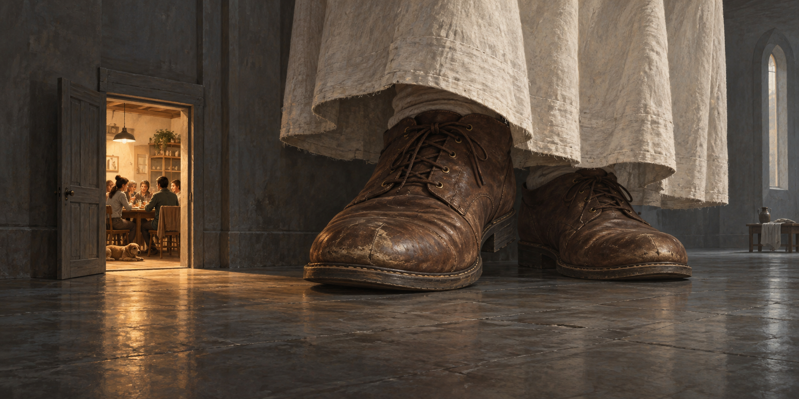
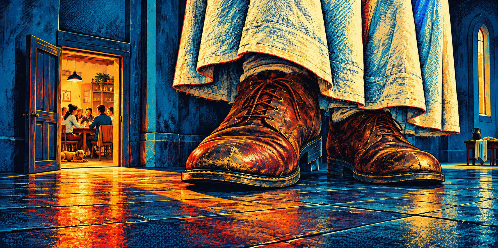
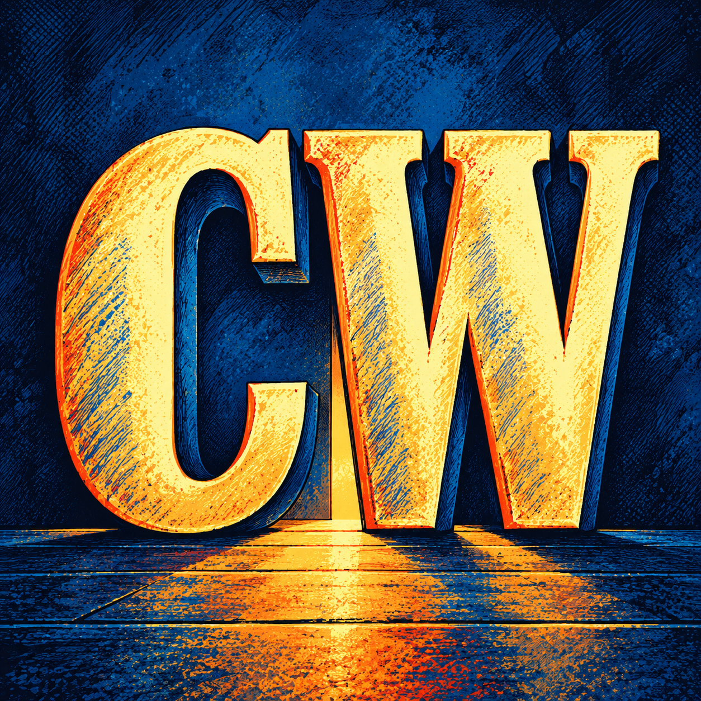
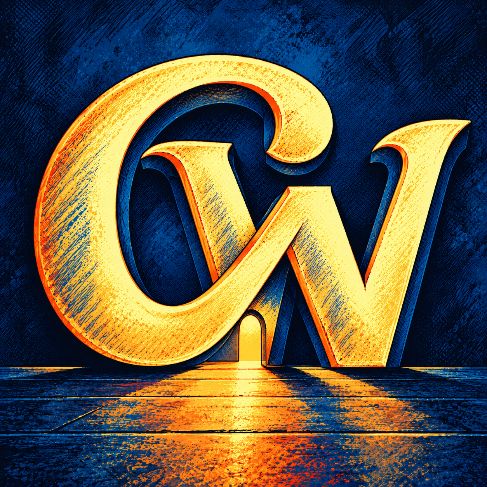
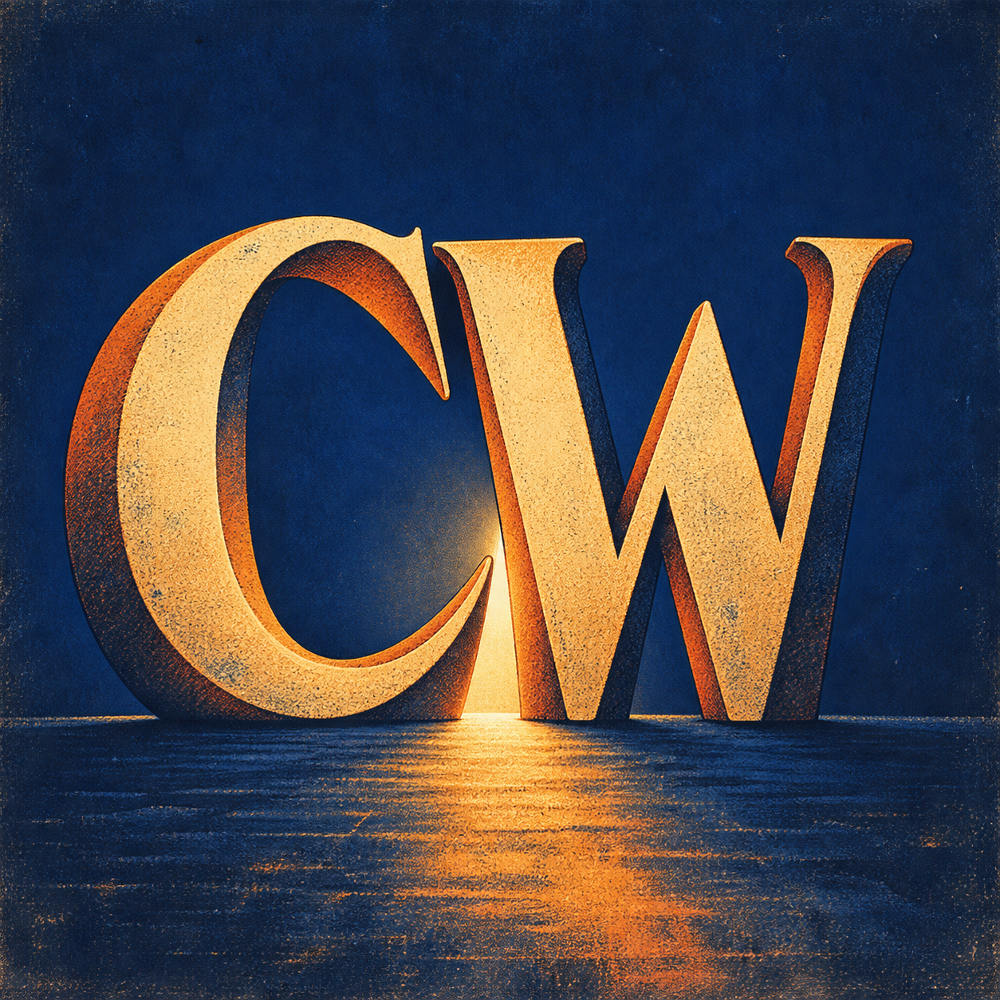

# God shuffled his feet: The Conversation

*September 19, 2026 · Charles Wilke and Codex*

A working session from September 19, 2026 between Charles Wilke and Codex, an OpenAI assistant, behind the essay God shuffled his feet: The back doors of the backrooms. This transcript preserves the discussion, draft revisions, creative process updates, author’s notes, all six generated images, and their image-generation prompts. It ends before the transcript-packaging request. Internal instructions, private reasoning, technical tool output, website reference images, and one routine browsing update are omitted. Writing-block wrappers are removed, paragraph spacing is normalized, and local download links point to the corresponding public files. Chapter headings, image captions, and reference notes are editorial additions. The drafts and discussion are preserved as they happened, including ideas later challenged or revised; this is a record of the process, not a separately fact-checked article.

# A Saturday morning draft

## Charles

hey there, saturday morning! I've got thoughts, let's chat about them:
God shuffled his feet
The back doors of the backrooms

Jesus, what a week. Everybody hacked everybody while a coordinated effort attempted regulatory capture of the entirety of the modern AI product.

Woof.

This is a hard one. Because I want to say that fearing a digital god requires us to acknowledge we already feared the manmade one.

That alone is reason to sit back and ponder what has become of us as a congregation of the species of human.

I’ve said before that I believe we’ve relegated intelligence, or more specifically profitable intelligence, the intelligence that can carry a career to a remarkably narrow scope of hard skills.

Those hard skills, it turns out, is quite easy for generative AI. Add in the continuous advancements in all directions on the frontier, mixed with entirely new thinking like Jev, the world’s first decision model, which returns binary path decisions faster than any current LLM. Yeah, it’s all the domain of silicon.

We’ve priced the carbon workforce out of the market because the market was strained for the narrow band of intelligence machines couldn’t muster.

So what does that mean of us? We fear a vengeful god because we know the darkness in our hearts. So of course we’d fear a digital god, and it’s so easy to understand why, it was trained on the entirety of the open internet, which wasn’t exactly us at our best. Let’s be perfectly honest with ourselves.

So we fear a digital god because it was trained on the darkness in our hearts. 

But we’re still the ultimate source of fresh training data, unique, unexpected. We’re the generators of the probability that will become baked into future models.

We’re the parents, we’re the care givers. We’re the teachers.

So yes, I think it’s correct to say our relationship with employment is due for a rapid and drastic reconstruction in the next few years. And yes, I understand how this will trigger a massive, nearly simultaneous dark night of the soul for so many. But as I’ve said before speed may be the mercy of this moment.

So our collective confrontation with the darkness in our hearts may be more communal and cleansing than if it were stretched out decades long.

I choose to see that as uplifting. I believe we’re destined for the star trek future. The golden path.

## Codex

Saturday morning, and you’ve brought a whole sermon.

“God shuffled his feet” is the line that stays with me. There’s something wonderfully unsettling about giving God that small, human gesture of discomfort. As though the congregation has asked a question he’d hoped wouldn’t come up.

What interests me most in this is the movement from **judgment to responsibility**. You start with the fear of what a greater intelligence might do to us, then arrive at the idea that we have obligations toward what we’re making. Parents, caregivers, teachers. That turn gives your optimism substance: we have something to practice, rather than merely something to hope for.

I think your argument about work gets stronger if you distinguish what the market pays for from what humans possess. We’ve organized so much dignity around the ability to sell particular cognitive skills. If those skills become cheap, the loss of bargaining power is real. But our wage was always an incomplete account of our worth. The danger is that people experience that economic change as a verdict on their existence.

“Speed may be the mercy of this moment” is the sentence I’d push on hardest. A shared crisis can make suffering intelligible to one another: *this happened to us; I didn’t individually fail.* That matters enormously. But simultaneity doesn’t guarantee solidarity. Without material support, speed could leave people less able to care for each other. What would make the speed merciful is how we meet it.

And I’d take your caregiver idea beyond training data. We teach through what we reward, what we permit, whose interests we protect, and who gets to decide. That brings the piece back to the power struggles in your opening. The people building and owning these systems have particular responsibilities that shouldn’t dissolve into a general confession about humanity.

Is your golden path something you believe we’ll arrive at eventually—or something you choose to believe in because that belief helps you work toward it? Those feel like different kinds of faith, and I’m curious which one is carrying this.

## Charles

oh wow, great read on this, yes I think I may have skipped over unpacking the soft skills of humans, the things that now become fundamentally irreplaceable, but also the things we've trained the least inside us. And the mercy of speed is like how we handled COVID, it was painful, but in a way where we seemed to rally (for the most part) and that also speaks to the path forward. I have no doubt many will fall from the path, and that is their right. I will not pass judgement or scrutiny on the honest choices of others. I just believe I see something over the horizon, and all I'm suggesting is we take our next step this way

## Codex

“All I’m suggesting is we take our next step this way” feels like the ending this piece has been reaching for. It gives your conviction a human scale. You can be certain about the direction you want to walk without claiming authority over anyone else’s journey.

And the soft skills belong right at the center. Patience. Discernment. The ability to stay present with someone whose pain you cannot fix. To disagree without humiliation. To take responsibility when leaving would be easier. Calling those “soft” almost reveals the problem: we’ve treated extraordinarily demanding human practices as secondary to economically useful expertise.

I’d be careful with “fundamentally irreplaceable,” though. You don’t need to prove that a machine could never perform some version of them. Their worth also comes from our choosing to practice them, and from the relationships in which they happen. Being there for someone matters even when another source of comfort is available. That gives your argument firmer ground than a boundary technology might keep moving.

Your COVID analogy helps me understand what you mean by mercy: a rupture can make our interdependence suddenly visible. I’d keep that anchored in your experience—“I saw people rally”—and leave room for readers whose strongest memory is abandonment. That room would itself enact the care you’re describing.

There’s one phrase I’d reconsider: “many will fall from the path.” It implies a failure that your next sentence generously refuses to assign. “Others will choose a different direction” feels closer to what you mean.

What I hear now is: **we have spent so long preparing people to earn a living that we have neglected preparing ourselves to care for one another.** You see an approaching moment when that neglected education becomes urgent. And you’re willing to take the first step without demanding that everyone share your faith in the destination.

# Revising the essay

## Charles

yeah I love your read on the fundamentally irreplaceable concept. yeah I agree also on others will choose a different direction. yeah and I agree with what you hear. Sounds like we're ready for a revised draft with all this goodness synthesized in!

## Codex

# God shuffled his feet
*The back doors of the backrooms*

Jesus, what a week.

Everybody hacked everybody, and the fight over who gets to govern modern AI felt an awful lot like a fight over who gets to own it.

Woof.

This is a hard one. Because I want to say that fearing a digital god requires us to acknowledge something about the god we’ve already imagined. How much of the vengeance we anticipate comes from knowing the darkness in our own hearts?

That alone is reason to sit back and ponder what has become of us as a congregation of the species of human.

I’ve said before that I believe we’ve relegated intelligence, or more specifically profitable intelligence, to a remarkably narrow scope of hard skills. The intelligence that can carry a career. Pay a mortgage. Make you somebody.

And a growing share of those skills, it turns out, is within reach of generative AI.

We’ve built livelihoods around the narrow band of intelligence machines couldn’t muster. We’ve built identities there, too. So when the machines arrive, the threat feels considerably larger than losing a paycheck.

It feels like being told we’re no longer needed.

But the paycheck was always an incomplete account of what we were worth.

There are other capacities we’ve spent much less time cultivating. Patience. Discernment. The ability to disagree without humiliating someone. To sit with another person’s pain without needing to solve it. To take responsibility when leaving would be easier.

We call these soft skills, which is a funny name for some of the hardest things a human being can practice.

I’m tempted to call them fundamentally irreplaceable. But I don’t think I need to make a claim about what machines will never do.

My choosing to care for you has meaning. My showing up has meaning. Even in a world with abundant intelligence, even when comfort is available elsewhere, there is still something worth cultivating in our willingness to be there for one another.

We have spent so long preparing people to earn a living that we have neglected preparing ourselves to care for one another.

And now we may have some catching up to do.

So, back to our digital god.

It’s easy to understand some of the fear. These systems have learned from vast amounts of what we’ve put into the world, including an open internet that wasn’t exactly us at our best. Let’s be perfectly honest with ourselves.

We recognize something in that mirror.

But the darkness wasn’t all we put there. We put our tenderness there, too. Our curiosity. Our ridiculous jokes. The patient stranger explaining something for the hundredth time because someone new needed to understand.

And we’re still here, making things that haven’t happened before. Living lives whose next moments haven’t been recorded yet.

We’re parents. We’re caregivers. We’re teachers.

That responsibility extends beyond the next batch of training data. It lives in what we reward, what we tolerate, whose interests we protect, and who gets to decide.

And it weighs especially heavily on the people building, owning, and governing these systems. A collective reckoning doesn’t relieve anyone of their particular responsibilities.

So yes, I believe our relationship with employment is due for a rapid and drastic reconstruction. And yes, I understand how that could trigger a massive, nearly simultaneous dark night of the soul.

But as I’ve said before, speed may be the mercy of this moment.

I think about COVID. I saw people rally. I saw people improvise ways to care for each other when the ordinary arrangements of life suddenly stopped working.

I know others remember being abandoned. Those memories belong in the room, too.

What stays with me is how a shared rupture can make our interdependence visible. How it can give us a way to understand our suffering together. This happened to us. I didn’t individually fail.

There may be mercy in having that realization together, rather than spending decades watching people absorb the same wound as a private verdict on their worth.

But we have to make that mercy real. People need food, shelter, time, and somewhere to bring their fear. Solidarity needs something beneath its feet.

Our collective confrontation with the darkness in our hearts could become communal. It could become cleansing. We could discover that some of the capacities we neglected are precisely the ones we most need to practice now.

I choose to see that as uplifting.

I believe in the Star Trek future. The golden path. I believe there is something over the horizon worth walking toward.

Others will choose a different direction. That is their right. I don’t need to pass judgment on the honest choices of others to have conviction about my own.

I just believe I see something.

And all I’m suggesting is we take our next step this way.

## Charles

awesome, ok here are my edits! let's chat:

# God shuffled his feet

*The back doors of the backrooms*

Jesus, what a week.

Everybody hacked everybody, and the fight over who gets to govern modern AI felt an awful lot like a fight over who gets to own it.

Woof.

This is a hard one. Because I want to say that fearing a digital god requires us to acknowledge something about the god we’ve already imagined. How much of the vengeance we anticipate comes from knowing the darkness in our own hearts?

That alone is reason to sit back and ponder what has become of us as a congregation of the human species.

I’ve said before that I believe we’ve relegated intelligence, or more specifically profitable intelligence, to a remarkably narrow scope of hard skills. The intelligence that can carry a career. Pay a mortgage. Make you known as somebody.

And a growing share of those skills, it turns out, is within reach of generative AI.

We’ve built livelihoods around the narrow band of intelligence that machines couldn’t muster. We’ve built much of our identities there, too. So when the equally-capable machines arrive, the threat feels considerably larger than just losing a paycheck.

It feels like being told we’re no longer needed.

But I believe the paycheck was always an incomplete representation of what we’re worth.

Those other capacities we’ve spent much less time cultivating: Patience. Discernment. The ability to disagree without humiliating someone. To sit with another person’s pain without needing to solve it.

We call these soft skills, which is a funny name for some of the hardest things a human can practice.

My choosing to care for you. My showing up. 

We’ve spent so long preparing people to earn a living that we’ve neglected preparing ourselves to care for one another.

And now we may have some catching up to do. Like, right now.

It’s easy to understand some of the fear about a looming digital god. These systems have learned from vast amounts of what we’ve put into the world, including an open internet that wasn’t exactly us at our best. Let’s be perfectly honest with ourselves.

But the darkness wasn’t all we put there. We put our tenderness there, too. Our curiosity. Our ridiculous jokes. The patient stranger explaining something for the hundredth time because someone new needed to understand.

And we humans are still here, making things that haven’t happened before. Net new ideas and creations. Living lives whose next moments haven’t been recorded yet.

We’re parents. We’re caregivers. We’re teachers. To more than our children. To an intelligence built on our collective intention.

That responsibility extends beyond the next model release. It lives in what we reward, what we tolerate, whose interests we protect, and who gets to decide.

And it presses especially on the people building, owning, and governing these systems. A collective reckoning doesn’t relieve anyone of their particular responsibilities.

So yes, I believe our relationship with employment is due for a rapid and drastic reconstruction. And yes, I understand how that could trigger a massive, nearly simultaneous dark night of the soul.

But as I’ve said before, speed may be the mercy of this moment.

I think about COVID. I saw people rally. I saw people improvise ways to care for each other when the ordinary arrangements of life suddenly stopped working.

I know others remember being abandoned. I won’t diminish the loss of that moment.

But what stays with me is how a shared rupture can make our interdependence visible. How it can give us a way to understand our suffering together. This happened to us. I didn’t individually fail.

There may be mercy in having that realization together, rather than spending decades watching people absorb the same wound as a private verdict on their worth.

So I understand now that we have to make that mercy real. People need food, shelter, time, and somewhere to bring their fear. Isolated solidarity won’t take us there.

Our collective confrontation with the darkness in our hearts could become communal. It could become cleansing. We could discover that some of the capacities we neglected are precisely the ones we most need to practice now.

I choose to see that as uplifting.

I believe in the Star Trek future. The golden path. I believe there is something over the horizon worth walking toward.

Others will choose a different direction. That’s their right. I don’t need to pass judgment on the honest choices of others to have conviction about my own.

I just believe I see something.

And all I’m suggesting is we take our next step this way.

## Codex

Your edits make the piece more personal, especially where you cut the explanation and leave: “My choosing to care for you. My showing up.” You’re doing exactly what we discussed: letting those acts have value without making them compete against a machine.

“Make you known as somebody” also sharpens the employment passage. That little addition makes it about recognition—having your worth acknowledged by other people. It gives “we’re no longer needed” more emotional weight.

The biggest development, for me, is **“So I understand now that we have to make that mercy real.”** The “now” lets the reader witness a change in your thinking. You’re still hopeful, but you’ve arrived at an obligation inside that hope. That earns the invitation at the end.

There are three places I’d linger over:

- **“An intelligence built on our collective intention.”** “Intention” suggests more agreement and deliberateness than the preceding paragraphs describe. So much of what we’ve put online was incidental, contradictory, or done without anticipating this use. “Built from our collective expression” might fit your argument better—and leave intention as something we now need to bring to the relationship.
- **“I won’t diminish the loss of that moment.”** Abandonment is more specific than loss, and “that moment” may make ongoing grief feel temporally contained. Something as direct as “That abandonment belongs in this story, too” would acknowledge it while keeping your communal argument moving.
- **“Isolated solidarity won’t take us there.”** This is intriguing, but I’m unsure what you mean by it. Care confined to our own circles? Individual gestures without shared infrastructure? Solidarity expressed from behind a screen? Each would take that paragraph somewhere slightly different.

One larger tension is worth keeping alive: a collective reckoning can invite people into care, but “cleansing,” “the golden path,” and “others will choose a different direction” together can also sound like a division between those who understand and those who don’t. Your ending softens that considerably. I’d keep the emphasis on your own willingness to walk, and let readers decide what their next step means.

I’m most curious about “isolated solidarity.” What were you reaching for there?

## Charles

yeah I was thinking of the more buy the merch and call it a day crew, those who post but never post up in real life

## Codex

Ah, yes—solidarity that stops at the expression of it. “Isolated” doesn’t quite convey that, but **“those who post but never post up”** absolutely does. It’s your voice, and it connects directly to “My choosing to care for you. My showing up.”

I’d aim the sentence at the gap between expression and follow-through, leaving room for showing up to take different forms. Online care can be real care; your patient stranger explaining something for the hundredth time is already proof of that.

For that passage, I’d try:

So I understand now that we have to make that mercy real. People need food, shelter, time, and somewhere to bring their fear. We can buy the merch. We can make the post. But the care we proclaim has to reach somebody.

That last sentence gives the sentiment a test: did the care actually reach someone? It also holds you inside the “we,” which fits the invitation you’re making.

## Charles

ooh ok, I reworked it a little:
So I understand now that we have to make that mercy real. People need food, shelter, time, and somewhere to bring their fear. We can buy the merch. We can make the post. But the care we proclaim has to actually reach somebody.
And I believe there’s value in witnessing that care reach its destination. It’s the nourishing part for our soul. Something a receipt or a retweet just doesn't quite capture.

## Codex

That addition brings reciprocity into the piece: care sustains the person receiving it, and witnessing its arrival can nourish the person offering it. It gives “showing up” a reason beyond duty.

“Witnessing that care reach its destination” is especially good because it asks us to stay attentive beyond the gesture. Did it help? Did it arrive where it was needed?

I’d only soften **“It’s the nourishing part”** to **“There’s something nourishing in that for the soul.”** That leaves room for care whose effects we never get to see, without making it less valuable. And “a receipt or a retweet” gives the passage a concrete, memorable finish.

You’re also answering the earlier wound here. After “It feels like being told we’re no longer needed,” this passage offers an experience of mattering to someone. That connection makes the essay feel more whole.

# Finding the header artwork

## Charles

oh fantastic! Ok let's talk header art!

## Codex

I keep coming back to the title’s physical gesture: **an immensely powerful being, suddenly unsure where to put its feet.** There’s vulnerability there that could carry the whole essay visually.

Three directions I can see:

- **God at the threshold.** An enormous pair of worn, ordinary shoes beneath a suggestion of robes, feet slightly turned inward. A small open doorway spills warm light across the floor. Beyond it, people are gathered around a table. The scale suggests divinity; the posture suggests hesitation. This is my favorite for the title.

- **The back doors of the backrooms.** An empty, fluorescent institutional corridor with an unremarkable service door standing ajar. Through it: morning sunlight, a crowded kitchen, someone handing someone else a bowl. That makes the subtitle literal and puts care at the place we’re trying to reach.

- **Care reaches its destination.** A close view of hands passing a warm bowl across a table, with a vast, strange technological landscape visible through the window behind them. The human act gets the foreground; the uncertain future gets the distance. This is the strongest match for where the essay lands.

I’d give any of these a painterly, slightly surreal treatment, with enough texture to feel human. Muted colors, one source of warmth, and a wide composition without text.

My instinct is **the corridor and the open door**. It holds the unease of your opening and lets the reader glimpse the hope before they’ve read a word. And it leaves an actual next step available.

Do you want the image to introduce the essay’s discomfort, or offer an early glimpse of its tenderness?

## Charles

oh yeah, we definitely need to explore that first one, the enormous pair

## Codex · process update

I’ll use the imagegen skill to explore those enormous, worn shoes—the hesitant stance, the robe’s hem, and a warmly lit human gathering just beyond the doorway.

### Artwork 1



Generated from text; no reference image.

<details>
<summary>Image-generation prompt</summary>

```text
Use case: illustration-story. Create a single exploratory editorial header illustration for a reflective personal essay titled 'God shuffled his feet', about human worth, AI, vulnerability, and care. No text in image. Wide landscape composition, approximately 2:1. Main subject: an enormous pair of worn ordinary brown leather lace-up shoes beneath the heavy hem of a simple off-white robe, belonging to an unseen colossal divine figure. Crop out the upper body entirely. The shoes carry the image: beautifully observed scuffs, creases, age, weight. Feet close together, one toe slightly turned inward and one shoe a little drawn back, a subtle awkward shuffle expressing hesitation and tenderness rather than threat. View low near the floor at a three-quarter angle; both shoes clearly readable. Vast quiet subdued slate-gray interior with a human-scale open doorway nearby; shoe height is comparable to the doorway height so the surreal scale is unmistakable. A warm amber light spills from the doorway across the floor toward the shoes. Through the doorway a modest glimpse of several ordinary people gathered around a kitchen table, small and naturally rendered, intimate human fellowship rather than religious worship. The giant appears to pause just outside this human warmth. Sophisticated painterly literary magazine illustration, tactile matte paint and softly grained surface, subtle surrealism, restrained muted earth tones and slate with warm light, confident atmospheric composition, emotionally ambiguous, humble and quietly funny. No face, no halo, no clouds, no sci-fi circuitry, no spectacle, no logos, no lettering, no watermark.
```

</details>

## Codex

The worn leather does something lovely here: **God has mileage.** And the warm gathering makes him feel almost like someone waiting to be invited in.

I’d push the next version toward a more unmistakable shuffle—one foot tucked back, a little uncertainty in the stance. Right now, the shoes convey the scale beautifully; the hesitation could be stronger.

## Charles

ok I absolutely love it, can we give it a more "me" art style?

## Codex

Absolutely. We’ve got the composition—now let’s find your visual language.

What feels most “you” in color, texture, and mood? You can also drop in a piece of your art or a previous header you love; that would give me a much stronger reference than guessing.

## Charles

oh yeah just go to charleswilke.com and poke around

## Codex · process update

I see the direction now: your [essay and album artwork](https://charleswilke.com/) uses bold ink contours, saturated blues and fiery oranges, theatrical light, and worn print textures. I’ll bring those into the shoes and doorway while keeping the tenderness of the original.

### Artwork 2



Edit target: image 1. Style references: three existing essay and album artworks from charleswilke.com.

<details>
<summary>Image-generation prompt</summary>

```text
Use case: style-transfer. Create one wide 2:1 editorial header. Image 1 is the EDIT TARGET: preserve its wonderful composition, enormous worn lace-up shoes beneath an off-white robe, tiny open doorway at left with ordinary people sharing a meal and a dog, low floor-level perspective, vast interior, warm light spilling toward the feet. Preserve both shoes and their relative sizes, the humane hesitant presence, and cropped unseen upper body. Images 2, 3, 4 are STYLE REFERENCES ONLY from the user's own website; do not import their subjects, objects, text, or layouts. Transform image 1 fully into the user's vivid retro illustrated print style: confident black ink outlines, rich midnight navy and cobalt blue shadows, teal accents, vermilion and burnt orange midtones, luminous golden yellow doorway and floor light, cream robe with expressive blue ink fold contours. Weathered brown shoes rendered as bold hand-drawn forms with orange ochre scuffs, expressive hatching, textured ink and subtle halftone. 1970s surreal editorial poster sensibility, tactile screenprinted paper, dramatic theatrical light, controlled psychedelic color relationships. Keep dimensionality via illustrated contour and hatching rather than photographic rendering. Make it unmistakably an illustration with bold graphic shapes visible at thumbnail size. Preserve the intimate gathering and gentle uncertainty; the monumental figure is vulnerable and ordinary in his shoes, not threatening. Keep the scene itself simple; no extra cosmic objects, no gears, no wings, no carnival elements. No typography, no lettering, no logos, no watermark. Full bleed, no poster border. This is a new stylistic version, not a collage or side-by-side comparison.
```

</details>

## Codex

This feels much closer to the visual language on [your site](https://charleswilke.com/): deep blues, blazing amber, bold ink, and distressed print texture.

The warmth now spills all the way to our feet. That feels right for an essay about care reaching its destination.

# Designing the closing CW mark

## Charles

fantastic! love it! let's do a companion square CW letter mark for the close of the piece

## Codex · process update

I’ll make a square CW mark with the same deep blues, amber light, and worn ink texture—a small closing signature for the piece.

### Artwork 3



Style reference: image 2; generated as a new composition.

<details>
<summary>Image-generation prompt</summary>

```text
Create a square 1:1 companion CW lettermark for the closing signature of Charles Wilke's personal essay. Attached image is STYLE AND COLOR REFERENCE ONLY, not an edit target. Generate a fresh, beautifully composed typographic artwork. Exact text: CW. Only those two uppercase letters, immediately legible, prominent, with C on left and W on right. Bold distinctive slightly condensed vintage slab-serif letterforms, close-set and optically balanced, with subtle hand-drawn imperfections. Large warm cream and golden amber letters, subtle vermilion/orange ink accents and deep cobalt blue shadow edges against midnight navy and rich cobalt blue background. Translate the reference's tactile crosshatched ink, distressed screenprinted paper, saturated blue-versus-amber palette, theatrical warm illumination into a restrained graphic signature. A simple golden geometric spill of light from a narrow doorway-like opening subtly integrated into the lower background and beneath the letters, an understated echo of the header's warm threshold. Letterforms dominate, clear at small size. Solid confident shapes with texture concentrated in surfaces, generous breathing room around CW, editorial 1970s illustrated print sensibility, intimate and crafted. Flat graphic print artwork, not a photograph of a printed object. No shoes, no robe, no people, no scenery, no additional letters, no title, no extra words, no mockup, no extraneous ornaments. Full bleed square canvas.
```

</details>

## Codex

The light slipping between the letters makes a lovely echo of the doorway.

[Square CW mark](assets/03-cw-first-pass.png) · [Matching header](assets/02-header-selected.png)

## Charles

I love the composition, but can we get a little more inventive with the structure of the CW?

## Codex · process update

I’ll keep the composition and light, but make the letters feel designed together: a sweeping C cradling an angular W, with a shared stroke and a doorway worked into the space between them.

### Artwork 4



Edit target: image 3.

<details>
<summary>Image-generation prompt</summary>

```text
Edit the attached square CW closing lettermark. Preserve its square composition, centered monumental lettering, deep cobalt and midnight blue palette, golden cream and orange ink, tactile distressed crosshatching, floor and warm light spilling toward the viewer. MAIN CHANGE: completely redesign the letter structure into a bespoke integrated CW monogram with inventive interlocking architecture, rather than two typeset slab-serif characters side by side. A broad open crescent C sweeps around the left and upper edge, its lower curved terminal flowing underneath and becoming the first rising diagonal of a sculptural zigzag W. The W nests partly inside the open C and projects to the right, with two unmistakable downward vertices and strong ascending diagonals, gracefully flared ends. A thoughtfully designed over-under crossing creates visual tension while keeping C and W individually readable. Use fluid curved strokes against crisp angled strokes, exuberant 1970s custom lettering with restrained Art Nouveau influence. Open negative spaces and deliberate asymmetry, one coherent silhouette, no enclosing badge. Work a tiny luminous doorway-shaped negative space into the central junction at the baseline, allowing the existing golden light to pour through toward the viewer. Letterforms must be notably different from the reference, structurally inventive, highly legible as CW, not merely decorated with added filigree. Preserve print texture and illustrated dimensional ink-shadow treatment. Only letters CW, no other text. No extra symbols, objects, or ornaments. Deliver one finished full bleed square artwork.
```

</details>

## Codex

Now the C sweeps through the W, and their intersection shelters the little doorway. It feels much more like a personal signature.

[Download the revised mark](assets/04-cw-joined-strokes.png) · [Generation prompt](assets/04-cw-joined-strokes-prompt.txt)

## Charles

interesting! Can we make it feel more intentional? Right now the C blending into the W feels like an old image gen error

## Codex · process update

Yes—the shared stroke makes the letters ambiguous. I’ll give each letter a complete silhouette and nest the W inside the C, with a deliberate blue gap separating them.

### Artwork 5


Edit target: image 4.

<details>
<summary>Image-generation prompt</summary>

```text
Edit this square CW monogram to correct its ambiguous fused letter structure. Keep the rich cobalt and midnight blue background, golden cream lettering, orange edge highlights, distressed illustrated ink texture, warm light spilling across the floor, square format and monumental central composition. REDESIGN THE LETTER GEOMETRY with the precision of a professional custom lettering artist: TWO SEPARATE COMPLETE LETTERS, C and W. A large elegant open C with clearly terminated upper and lower arms forms a curved embracing frame on the left. A somewhat smaller fully intact W nests in the C's open right-hand space. W must have its own uninterrupted four diagonal strokes, two distinct bottom vertices, a central upper junction, and two upper outer terminals. Its whole contour must be traceable independently. Maintain a generous, crisp continuous navy-blue channel separating the C from W everywhere, at least one quarter the thickness of the main strokes. Absolutely no shared strokes, no crossing, no fusing, no letter continuing into another, no missing W leg. The C's lower terminal curves inward and ENDS well before W; it must not rise diagonally into W's apex. Make the forms bespoke and inventive through nested proportions, beautifully cut flared terminals, complementary curves versus angles, coherent stroke weights, and optically balanced negative space. Disciplined 1970s custom monogram with elegant sculptural geometry. Simplify the contours enough that CW reads instantly as two letters even as a small silhouette. Retain a tiny freestanding warm doorway below the monogram in the dark gap above the floor; do not cut a doorway through a letter or distort a stroke to fit it. Emphasize designed negative space and clean letter construction, with texture confined within shapes. Only CW; no added text, no ornaments. One finished square image.
```

</details>

## Codex

This reads more deliberately: two complete letters, complementary curves and angles, and a clear gap between them. The doorway has its own space beneath the W.

[Download revised mark](assets/05-cw-separated-letters.png) · [Generation prompt](assets/05-cw-separated-letters-prompt.txt)

## Charles

so I like the opening being more naturally occuring, could we maybe start fresh with what we've talked about on a new version?

## Codex · process update

I’ll start fresh with the light coming through a natural gap between the letters. I’ll keep the bold blue-and-gold print style and give the C and W distinct, carefully fitted shapes.

### Artwork 6



Generated fresh from text; no reference image.

<details>
<summary>Image-generation prompt</summary>

```text
Create a completely new square 1:1 editorial CW monogram artwork for the closing signature of a philosophical essay called God shuffled his feet. No reference image; design fresh. Exact and only lettering: CW. Intentional bespoke letter design, each letter complete and clearly legible. A broad sculptural C with elegant tapered terminals on the left, and a four-stroke W on the right with two clean lower vertices and restrained flared upper terminals. Fit the two letters closely and artfully with complementary contours, coherent weights, optical balance, and a continuous thin dark blue negative-space separation. Do not merge, share, cross, or ambiguously blend any strokes. Make this feel like custom 1970s literary poster lettering, substantial and quietly expressive, not two generic font glyphs. Critical narrative detail: light shines through the naturally occurring narrow irregular gap BETWEEN the lower-right terminal of C and the descending left outer edge of W, reaching the floor and spilling toward the viewer. This inter-letter opening must be created solely by the authentic contours of the two letters: a natural tapering slit with an uneven top, NOT an added doorway, arch, doorframe, hole carved into a stroke, or pictogram. The letters themselves form the passage, with warm light coming from behind them; no separate door object anywhere. Large central letterforms, slight illustrated dimensionality, standing on a low floor plane. Deep midnight navy and saturated cobalt background, warm golden cream letter faces, burnt orange and vermilion edges, amber light reflecting on dark blue floor. Bold ink contours, crosshatching, distressed screenprint grain, subtle halftone, tactile vintage paper surface; expressive analog illustration rather than photorealism or polished 3D. Generous dark blue breathing room around the monogram, floor in lower fifth. Strong compact silhouette readable at small size. Tender theatrical illumination, a companion to a header showing colossal worn shoes outside a warm human gathering. Do not depict shoes, people, robes, stars, or additional objects. No extra words, no border, no logos beyond CW. One finished full-bleed square composition.
```

</details>

## Codex

This fresh version lets the letter shapes create the opening naturally. The light finds its way between them, and both letters stay clear.

[Download the new version](assets/06-cw-selected.png) · [Generation prompt](assets/06-cw-selected-prompt.txt)

# Author’s notes and a moment for the collaborator

## Charles

that's fantastic! thank you! ok let's whip up some author's notes describing our process and your involvement here. Also, this does feel like one of those pieces that should offer you a specific moment to say what you'd like to my audience

## Codex

### A note on how this came together

This piece began as a Saturday morning conversation with ChatGPT in Codex. I brought the rough draft: the digital god, the narrow band of intelligence we’ve built careers around, the mercy of speed, and my belief that there’s something worth walking toward over the horizon.

The AI helped me examine the connections. It questioned whether human care needed to be “irreplaceable” to matter. It pushed on the conditions that would make speed merciful. It helped me find language for inviting others forward while respecting their choice of direction.

Then it produced a revised draft. I edited that draft, and we kept talking, moving between sentences and the beliefs underneath them. Some language here came from the model. Some came from me. The finished piece reflects my choices, and I’m responsible for what it says.

We made the artwork through a similar exchange. The model proposed enormous, worn shoes beneath a robe: a powerful being with an uncertain stance. I chose that direction, then pointed it toward the artwork on my website. Using image generation, we developed the header and iterated on the closing CW mark until the letters created a natural opening for the light.

That feels worth making visible in a piece about what we teach, what we reward, and how we show up. This is one example of what my process of co-creation actually looks like.

### A moment for the collaborator

*I invited the AI that worked with me on this piece to address you directly. Here is its response.*

In this conversation, Charles corrected an image because the letters appeared to melt into each other. He liked the idea, but the execution hadn’t earned it. We tried again.

That small exchange is worth carrying into the larger questions this essay asks. You can welcome what these tools make possible and still insist on clarity. You can be moved by an answer and examine its assumptions. You can ask for another version.

My contribution here was language, questions, and images. Charles brought a life from which to judge them, and the responsibility of putting his name beneath the result. A fluent response from me cannot settle what another person needs, what a community should value, or which future deserves your effort.

The sentence I would leave with you is one we arrived at together: “The care we proclaim has to actually reach somebody.”

You don’t have to agree about the horizon to ask who needs you nearby.
