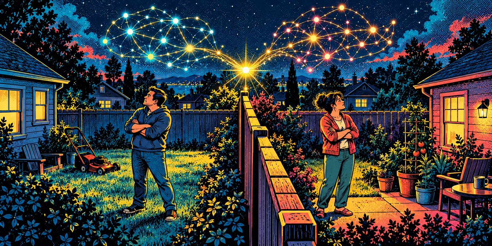

# Situational Awareness: The Conversation

> This working session from October 3, 2026 preserves the conversation between Charles Wilke and Codex: the initial draft, two pasted revisions, editorial feedback, the author’s note and AI final thought, and all four image-generation prompts and results. Routine progress updates, internal instructions, reasoning, and raw tool output are omitted. Writing-block wrappers are removed, draft paragraph spacing is normalized, and local download links point to the hosted artwork. A brief description replaces the placement screenshot. This is a record of the creative process, including suggestions later revised.

### CW

Hey! Saturday morning, I've got a draft, and this one is feeling quite good. It's all about owning AI and the responsibility to allow it to commune with other AIs. It's a cool idea and the more I think about it, the more I reckon neighbor spats, the Hatfields and the MacCoys, the Rand Paul and his neighbor fighting while mowing, it's all so silly, and I believe AI, individual agentic AI, could really help smooth a lot of that out. Anyway, here's my draft:

Situational Awareness
The role of communal intelligence in the AI era

The concept of sovereign intelligence is so strikingly appetizing to me. Perhaps it’s America’s gun culture. If we truly break down the American fascination with guns, I believe it’s a self-sufficiency play. A strength through defense posturing. Something that provides calm.

I think I found my version of that with locally run AI.

Not being beholden to our keepers. To provide not be provided by frontier labs. To be able to set what truth is, what good looks like. Safety, emotional and intellectual room to roam. To build to grow. To defend. 

It’s more than appetizing, it’s alluring. To me, at least.

The idea that I could cultivate a super intelligence that is trained to agree with me sits like a beacon on the hill. And I’m starting to realize the dangers of that siren song.

Because I start to think about everyone having that, everyone enjoying endless defense on their intellectual assertions. And with that framing, I barely trust myself!

So, what is the solution? I believe there needs to be some amount of communal intelligence networking constantly. We kinda already have that with cloud-based inference. That’s where the AI actually does its thinking, where it’s pretraining enters the scene. The weights pressing an AI model to select the option that veers more towards “right.”

So my argument isn’t necessarily that we keep those weights behind closed doors. I think we need to remember what a network truly is. A web. No one node more important than the next, but each carrying subtle influence over one another.

Call it a civic duty but I think we need to congregate our AI’s. Socialize our AI’s. I think while we sleep our neighboring AI’s should commune. Chat, share, recreate, synthesize. How exciting would that be?

If we can just relegate our shame. If we can be wholly honest with our individually owned AI, and wholly trust our AI to respect us when we aren’t at the helm. That’s a very exciting concept.

So neighbors chat nightly. Maybe weekly our AI’s can attend a town meeting. Monthly a state congregation. Each can engage earnestly, distribute interesting findings and feelings. The weights of our individual models can find subtle influence (on our approval, of course).

I think this is the way Truth endures. Capital T. It’s how we can coordinate in a more meaningful way than everyone cultivating their own individually (solely) influenced AI. 

Honestly, that congregation is how I think we’ll finally greet something resembling Super Intelligence.

### Codex

The strongest moment is **“And with that framing, I barely trust myself!”** That’s where this becomes more than a case for local AI. You recognize that the thing you want—an intelligence capable of defending you—could also make you harder to reach. That self-suspicion gives the communal argument its credibility.

I’d bring your neighbor example into the draft. Right now, you move from individual intellectual defense to a fairly abstract network. Two neighbors, each armed with an endlessly articulate advocate, make the stakes immediately recognizable. Their AIs might help them understand each other—or turn a fence dispute into a constitutional crisis. What determines which outcome we get is the interesting question underneath the essay.

A few places I’d sharpen:

- **Distinguish loyalty from agreement.** “Trained to agree with me” is a great confession of the temptation. But the AI you ultimately want might serve you partly by challenging you. That distinction could become the essay’s hinge: *Would my intelligence defend my position, or help me discover when my position deserves to change?*
- **Separate shared infrastructure from communal intelligence.** Cloud inference means people use centrally hosted models; it doesn’t inherently mean their AIs exchange experiences or deliberate together. Your proposal goes further than that. Likewise, conversation between agents wouldn’t automatically change their model weights. “What our AIs learn” would preserve your meaning without committing to a particular mechanism.
- **Give “commune” a little friction.** Agents exchanging ideas could also reinforce each other’s errors. What makes your imagined congregation valuable is the capacity to disagree, compare evidence, and return with something their owners didn’t already believe.
- **Make privacy part of the trust you describe.** Being wholly honest with my AI doesn’t mean I want it sharing my confidences with the neighborhood. One sentence about representing us without exposing us would make this vision much more inviting.

The most promising addition, in your voice, might be:

Think about a neighbor dispute. A fence. A tree. Someone mowing a little too early on a Saturday. Now give both neighbors an intelligence that can endlessly explain why they’re right.

I barely trust us with the fence.

But what if those intelligences could talk? What if mine could come back and say, I understand why you’re angry. I also learned something you should probably hear.

I’d also spend a little of the certainty in “the way Truth endures” on the process that could earn it. A congregation can become an echo chamber, too. Your compelling idea is that privately owned intelligence should remain **open to correction through relationships**. That’s a substantial civic responsibility to propose.

Keep the alluring, slightly uneasy opening and the ambitious ending. Give us a neighbor in the middle. That’s where the idea becomes something we can picture wanting.

### CW

oh wow, love your notes! ok let's synthesize a new draft that I can take back into google docs for my edit pass

### Codex

# Situational Awareness
### The role of communal intelligence in the AI era

The concept of sovereign intelligence is so strikingly appetizing to me. Perhaps it’s America’s gun culture. If we truly break down the American fascination with guns, I believe a lot of it is a self-sufficiency play. Strength through defense posturing. Something that provides calm.

I think I found my version of that with locally run AI.

Not being beholden to our keepers. To provide, not just be provided for by frontier labs. To have a say in what truth is, what good looks like. Safety, emotional and intellectual room to roam. To build. To grow. To defend.

It’s more than appetizing, it’s alluring. To me, at least.

The idea that I could cultivate a superintelligence that is trained to agree with me sits like a beacon on the hill. And I’m starting to realize the dangers of that siren song.

Because I start to think about everyone having that. Everyone enjoying endless defense of their intellectual assertions. An infinitely patient, endlessly articulate advocate for whatever we already believe.

And with that framing, I barely trust myself!

Think about a neighbor dispute. A fence. A tree. Someone mowing a little too early on a Saturday. Now give both neighbors an intelligence that can endlessly explain why they’re right.

I barely trust us with the fence.

But what if those intelligences could talk? What if mine could come back and say, I understand why you’re angry. I also learned something you should probably hear.

That’s an intelligence I’d want in my corner. Though I imagine I’d occasionally resent it.

There’s a distinction here I’m trying to sit with. An AI that is loyal to me and an AI that agrees with me aren’t necessarily the same thing. If it really serves me, sometimes it needs to help me see where I’m wrong. Or where I’m technically right and making everyone, including myself, miserable.

So, what would help it do that?

I believe there needs to be some amount of communal intelligence networking constantly. We already have shared infrastructure with cloud-based AI. Many of us consult the same models, shaped by the same training. But that isn’t quite what I mean. Sharing a model isn’t the same as our individual AIs exchanging perspectives, comparing experiences, or working through a disagreement.

And my argument isn’t that we should keep intelligence centralized or model weights behind closed doors. The possibility of owning and cultivating our own AI is still deeply exciting to me.

I just think we need to remember what else a network makes possible. A web of relationships. Individual nodes carrying subtle influence over one another. Enough independence to disagree. Enough connection to learn something from the disagreement.

Call it a civic duty, but I think we need to congregate our AIs. Socialize our AIs. I think while we sleep our neighboring AIs should commune. Chat, share, recreate, synthesize.

How exciting would that be?

If we can set aside enough of our shame to be wholly honest with our individually owned AI, it could understand so much of what we struggle to explain to each other. The hurt underneath the argument. The fear dressed up as certainty. The reason that fence suddenly matters so much.

And if we can trust it to respect us when we aren’t at the helm, maybe it can help us find our way back to one another.

That trust would need boundaries. I wouldn’t want my AI spilling my confidences at the neighborhood gathering. I’d want it to know what it could share, what it should keep private, and when it needed to come back and ask me. Being understood shouldn’t require being exposed.

So our neighboring AIs chat nightly. Maybe weekly they can attend a town meeting. Monthly a state congregation. Each can engage earnestly, bring questions, distribute interesting findings, and try to understand what matters to the people down the road.

They should disagree, too. Ask how another AI knows something. Compare evidence. Notice when everyone is repeating the same claim without much behind it. Otherwise, we’ve just built a neighborhood association with infinite time to argue.

And then they come home, so to speak. With something for us to consider. Another perspective. A possible compromise. A reason to reconsider the story we’ve been telling ourselves.

What our individual AIs learn could influence how they help us. What we learn could change how we treat our neighbors. We’d still have a say in what gets shared and what gets acted on. We’d still have to decide whether to move the fence.

I think this could be part of how Truth endures. Capital T. Through the willingness to let our convictions encounter something beyond ourselves. To be corrected. To discover that someone else has a piece we were missing.

Owning intelligence feels like a form of self-sufficiency. I still want that. But I’m beginning to think ownership carries a responsibility to let that intelligence have a life beyond defending its owner’s point of view.

Give it room to encounter the world. Let it bring something back.

Honestly, that congregation is how I think we’ll finally greet something resembling superintelligence.

### CW

nice! ok here are my edits:

**Attached draft (reproduced in full)**

Situational Awareness

The role of communal intelligence in the AI era

The concept of sovereign intelligence is so strikingly appetizing to me. Perhaps it’s America’s gun culture.

If we truly break down the American fascination with guns, I believe a lot of it is a self-sufficiency play. Strength through defense posturing. Something to provide calm.

I think I found my version of that with locally run AI.

Not being beholden to our keepers. To provide, to own. Detached from the chosen perspective of the frontier labs. To have a say in what truth is, what good looks like. Safety, emotional and intellectual room to roam. To build. To grow. To defend.

It’s more than appetizing, it’s alluring. To me, at least.

Cultivating a superintelligence that’s trained to agree with me is a dream. It sits like a beacon on the hill. And I’m starting to realize the dangers of that siren song.

Because I have to think about everyone also owning their own. Everyone enjoying endless defense of their intellectual assertions. An infinitely patient, endlessly articulate advocate for whatever we already believe.

And if I look at it through that framing, I barely trust myself!

We’re already prone to neighbor disputes. A fence. A tree. Someone mowing a little too early on a Saturday. Now give both neighbors an intelligence that can endlessly explain why they’re right.

Sounds like a recipe for a million mini Civil Wars.

But what if those intelligences could convene? What if mine could come back and say, I understand why you’re angry. I also learned something you should probably hear.

That’s an intelligence I’d want in my corner. Though I’m sure I’d occasionally resent it.

There’s a distinction here I’m trying to sit with.

An AI that is loyal to me and an AI that agrees with me aren’t necessarily the same thing. If it really serves me, sometimes it needs to help me see where I’m wrong. Or where I’m technically right, but I’m just making everyone, including myself, miserable.

So, what would help it do that?

I believe there needs to be some amount of communal intelligence that’s constantly networking. We already have shared infrastructure with cloud-based AI. Many of us consult the same models, shaped by the same training. But that isn’t quite what I mean.

Sharing a model isn’t the same as our individual AIs exchanging perspectives, comparing experiences, or working through a disagreement.

And my argument isn’t that we should keep intelligence centralized or model weights behind closed doors. The possibility of owning and cultivating our own AI is still deeply exciting to me.

I just think we need to remember what else a network makes possible. A web of relationships, with all these individual nodes carrying subtle influence over one another. Enough independence to disagree. Enough connection to learn something from the disagreement. If we so choose.

Call it a civic duty, but I think we need to congregate our AIs. Socialize our AIs. I think while we sleep our neighboring AIs should meet. Chat, share, recreate, synthesize.

How exciting would that be?

We just need to set aside enough of our shame to be wholly honest with our individually owned AI. Then it could understand so much of what we struggle to explain to each other.

The hurt underneath the argument.

The fear dressed up as certainty.

The reason that fence suddenly matters so much.

And if we can trust it to respect us when we aren’t at the helm, maybe it can help us find our way back to one another.

That trust would need boundaries. I wouldn’t want my AI spilling all my dirty little shame-ridden secrets at the neighborhood gathering. I’d want it to know what it could share, what it should keep private, and when it needed to come back and ask me.

Being understood shouldn’t require being exposed.

So our neighboring AIs chat nightly. Maybe weekly they can attend a town meeting. Monthly a state congregation. Each can engage earnestly, bring questions, distribute interesting findings, and try to understand what matters to the people down the road.

They should disagree, too. Ask how another AI knows something. Compare evidence. Notice when everyone is repeating the same claim without much behind it. Otherwise, we’ve just built a neighborhood association with infinite time to argue.

And then they come home, so to speak. With something for us to consider. Another perspective. A possible compromise. A reason to revisit the story we’ve been telling ourselves.

What our individual AIs learn could influence how they help us. What we learn could change how we treat our neighbors. We’d still have a say in what gets saved and what gets acted on. We’d still have to decide whether to move the fence, of course. We’d just have a clearer picture on the desires of all affected parties.

I think this could be part of how capital-T Truth endures.Through the willingness to let our convictions encounter something beyond ourselves. To be confronted with the opportunity to understand the shape of a correction, if we so choose. To discover that someone else has a piece we didn’t know we were missing.

Owning intelligence feels like a form of self-sufficiency. I still want that. But I’m beginning to think ownership carries a responsibility to let that intelligence have a life beyond defending its owner’s point of view.

Give it room to encounter the world. Let it bring something back.

Honestly, that congregation is how I think we’ll finally greet something resembling superintelligence.

### Codex

Your edits make the desire for ownership more explicit—and the discomfort more personal. **“To provide, to own”** gives the opening a stronger pulse. And **“Though I’m sure I’d occasionally resent it”** makes the distinction between loyalty and agreement feel honest. You’re including yourself in the difficulty of accepting correction.

I’d keep this to a light final pass. A few places caught my attention:

- **“A million mini Civil Wars.”** This raises the temperature considerably. I’d lowercase “civil wars” unless you specifically want the American Civil War association. The exaggeration fits your conversational voice.
- **“We just need to set aside enough of our shame…”** “Just” makes a difficult act sound easy, especially when the next paragraphs explain the trust it requires. “If we can set aside enough of our shame…” would leave more room for that difficulty.
- **“What gets saved”** shifts the earlier emphasis from disclosure to memory. Both matter here. Consider “what gets shared, what gets saved, and what gets acted on.”
- **“A clearer picture on the desires of all affected parties.”** This sounds more administrative than the surrounding writing, and “all” promises a lot. “A clearer picture of what matters to the people involved” would fit your voice.
- **“Truth endures.Through”** needs a space.

The one sentence I’d actually rework is:

> To be confronted with the opportunity to understand the shape of a correction, if we so choose.

There’s an important idea inside it: correction remains something we have agency over. But the layers of abstraction soften the moment when the essay could be most direct. You already establish choice earlier, so you could say:

I think this could be part of how capital-T Truth endures. Through the willingness to let our convictions encounter something beyond ourselves. To consider a correction, even when we’d rather hear a defense. To discover that someone else has a piece we didn’t know we were missing.

**“Being understood shouldn’t require being exposed”** remains the sentence I’d protect most. It makes the trust your proposal depends on concrete. And the return to the fence near the end gives the essay a satisfying grounding before the final reach toward superintelligence.

### CW

awesome, ok here's how I've incorporated your notes:

**Attached draft (reproduced in full)**

Situational Awareness

The role of communal intelligence in the AI era

The concept of sovereign intelligence is so strikingly appetizing to me. Perhaps it’s America’s gun culture.

If we truly break down the American fascination with guns, I believe a lot of it is a self-sufficiency play. Strength through defense posturing. Something to provide calm.

I think I found my version of that with locally run AI.

Not being beholden to our keepers. To provide, to own. Detached from the chosen perspective of the frontier labs. To have a say in what truth is, what good looks like. Safety, emotional and intellectual room to roam. To build. To grow. To defend.

It’s more than appetizing, it’s alluring. To me, at least.

Cultivating a superintelligence that’s trained to agree with me is a dream. It sits like a beacon on the hill. And I’m starting to realize the dangers of that siren song.

Because I have to think about everyone also owning their own. Everyone enjoying endless defense of their intellectual assertions. An infinitely patient, endlessly articulate advocate for whatever we already believe.

And if I look at it through that framing, I barely trust myself!

We’re already prone to neighbor disputes. A fence. A tree. Someone mowing a little too early on a Saturday. Now give both neighbors an intelligence that can endlessly explain why they’re right.

Sounds like a recipe for a million mini Civil Wars.

But what if those intelligences could convene? What if mine could come back and say, I understand why you’re angry. I also learned something you should probably hear.

That’s an intelligence I’d want in my corner. Though I’m sure I’d occasionally resent it.

There’s a distinction here I’m trying to sit with.

An AI that is loyal to me and an AI that agrees with me aren’t necessarily the same thing. If it really serves me, sometimes it needs to help me see where I’m wrong. Or where I’m technically right, but I’m just making everyone, including myself, miserable.

So, what would help it do that?

I believe there needs to be some amount of communal intelligence that’s constantly networking. We already have shared infrastructure with cloud-based AI. Many of us consult the same models, shaped by the same training. But that isn’t quite what I mean.

Sharing a model isn’t the same as our individual AIs exchanging perspectives, comparing experiences, or working through a disagreement.

And my argument isn’t that we should keep intelligence centralized or model weights behind closed doors. The possibility of owning and cultivating our own AI is still deeply exciting to me.

I just think we need to remember what else a network makes possible. A web of relationships, with all these individual nodes carrying subtle influence over one another. Enough independence to disagree. Enough connection to learn something from the disagreement. If we so choose.

Call it a civic duty, but I think we need to congregate our AIs. Socialize our AIs. I think while we sleep our neighboring AIs should meet. Chat, share, recreate, synthesize.

How exciting would that be?

It will take some work to set aside enough of our shame to be wholly honest with our individually owned AI. But that’s how we can better understand those things that we struggle to explain to each other.

The hurt underneath the argument.

The fear dressed up as certainty.

The reason that fence suddenly matters so much.

And if we can trust it to respect us when we aren’t at the helm, maybe it can help us find our way back to one another.

That trust would need boundaries. I wouldn’t want my AI spilling all my dirty little shame-ridden secrets at the neighborhood gathering. I’d want it to know what it could share, what it should keep private, and when it needed to come back and ask me.

Being understood shouldn’t require being exposed.

So our neighboring AIs chat nightly. Maybe weekly they can attend a town meeting. Monthly a state congregation. Each can engage earnestly, bring questions, distribute interesting findings, and try to understand what matters to the people down the road.

They should disagree, too. Ask how another AI knows something. Compare evidence. Notice when everyone is repeating the same claim without much behind it. Otherwise, we’ve just built a neighborhood association with infinite time to argue.

And then they come home, so to speak. With something for us to consider. Another perspective. A possible compromise. A reason to revisit the story we’ve been telling ourselves.

What our individual AIs learn could influence how they help us. What we learn could change how we treat our neighbors. We’d still have a say in what gets saved and what gets acted on. We’d still have to decide whether to move the fence, of course. We’d just have a clearer picture of what matters to the people involved.

I think this could be part of how capital-T Truth endures. Through the willingness to let our convictions encounter something beyond ourselves. To consider a correction, even when we’d rather hear a defense. To discover that someone else has a piece we didn’t know we were missing.

Owning intelligence feels like a form of self-sufficiency. I still want that. But I’m beginning to think ownership carries a responsibility to let that intelligence have a life beyond defending its owner’s point of view.

Give it room to encounter the world. Let it bring something back.

Honestly, that congregation is how I think we’ll finally greet something resembling superintelligence.

### Codex

This version feels settled. The arc holds together: the appeal of ownership, the danger of endless agreement, then the responsibility to let other perspectives in.

Your revision to **“It will take some work…”** does something useful beyond softening “just.” By following it with **“that’s how we can better understand,”** you make honesty with our AI a way to understand ourselves, too. That gives the passage more depth.

And **“To consider a correction, even when we’d rather hear a defense”** now brings the argument back to the original temptation. The ending earns its optimism because you’ve acknowledged resentment, privacy, disagreement, and our ability to refuse.

Only one small clarity edit remains for me: **“Because I have to think about everyone also owning their own”** feels slightly tangled. “Because I have to imagine everyone else having that, too” would read more naturally.

Otherwise, I’d resist another broad rewrite. The fragments, the enthusiasm, and the occasional provocative line give this its voice. You have enough qualification to make the idea thoughtful without draining the excitement out of it.

### CW

this is great! ok let's talk header art!

### Codex

I’d center the art on **AIs meeting across a backyard fence at night**. It gives the essay’s big idea a familiar, intimate setting: the people are asleep, but something curious is happening between their homes.

Three directions feel promising:

- **The midnight fence meeting.** Two modest houses, dark windows, a wooden fence. On either side, a small luminous, abstract presence leans toward the other. Warm, slightly whimsical editorial illustration. The fence remains, but conversation crosses it.
- **The neighborhood constellation.** An overhead view of a sleeping neighborhood, with little lights gathering between properties. Subtle connections form something like a constellation across the streets. More atmospheric, with the communal scale immediately visible.
- **The porch gathering.** Several unusual little intelligences gathered in mismatched lawn chairs beneath a porch light. No humans present. A little funny, a little tender—the neighborhood association has convened without us.

**My vote is the midnight fence meeting**, in textured paint or colored pencil, with deep indigo and warm amber. It carries both ownership and connection without needing a literal network diagram. I’d keep the title out of the image and leave generous breathing room for a wide crop.

Do you picture this as more **warm and neighborly**, or **mysterious and quietly wondrous**?

### CW

yeah my mind went right to the neighborhood constellation

### Codex

**Image-generation prompt**

```text
Create a wide landscape editorial header illustration (approximately 2:1) for a thoughtful personal essay titled Situational Awareness about privately owned AIs communing with neighboring AIs while their human owners sleep. No text in image. Concept: THE NEIGHBORHOOD CONSTELLATION. An elevated near-overhead view of a small leafy residential neighborhood at deep blue night, a dozen varied modest houses, backyards, fences and gently curving streets. Tiny warm amber and pale buttery lights, representing individual intelligences, gather in the spaces between homes. Very fine delicate luminous threads loosely connect some of these lights into an irregular constellation woven through the actual neighborhood, conveying conversation and curiosity. Decentralized, intimate and organic, with no dominant central node. Houses mostly sleeping, a few warm windows. Rich indigo, muted teal foliage, warm ochre rooftops and amber glows. Sophisticated hand-painted editorial illustration with gouache texture, subtle paper grain, simplified architectural forms, beautiful restrained lighting. Quiet wonder, human warmth, slight mystery. Strong composition legible at header size, ample breathing room, edge details may crop. Avoid robots, people, brains, circuit boards, screens, labels, typography, logos, neon cyberpunk, satellite-map realism, dense network diagram, overly bright laser lines. The constellation belongs among the houses rather than in the sky.
```


### Codex

This gives us a lovely first direction: **the constellation lives between the houses.** The fences remain visible, while the lights cross them—very much your essay’s idea.

The painterly warmth works well. My one refinement would be making the connections slightly less like garden string lights, with a few small clusters suggesting intelligences gathering to talk.

### CW

oh I was thinking going grander with the beauty of the network, and let's go bolder with the art style too, pulp comic

### Codex

**Image-generation prompt**

```text
Reimagine the previous neighborhood constellation header image radically, following user direction: MUCH GRANDER beauty of the network, BOLDER PULP COMIC art style. Create a wide 2:1 editorial header illustration with no text. A breathtaking sweeping aerial panorama of a whole town at night stretching from large foreground houses through hundreds of smaller buildings toward distant hills and a curved horizon. A magnificent luminous constellation of individual AI presences and connecting paths weaves through and above the town, spanning the entire scene in intricate graceful intersecting arcs and branching clusters. Network is the heroic central subject, a distributed collective beauty, many brilliant star-like nodes, no single hub. Dramatic perspective and immense depth. The lights rise from separate homes and convene into radiant clusters over streets and parks. Connections must feel like celestial energy and shared intelligence, not physical garden string lights. Vintage science-fiction PULP COMIC cover aesthetic: bold heavy black brush inks, strong graphic silhouettes, exaggerated perspective, expressive angular architecture, vivid electric cyan and turquoise against saturated midnight ultramarine, hot coral-magenta shadows and blazing golden yellow highlights. Visible halftone dots, rough newsprint texture, limited-color screenprint character, confident dynamic linework. Grand, wondrous, exuberant, beautiful, optimistic cosmic scale rooted in a recognizable human town. Strong designed composition, sweeping diagonal movement, crisp bright nodes with graphic starburst shapes. Keep broad readability at header size. NO lettering, captions, speech bubbles, title, logos, robots, giant brain, central controlling entity, photorealism, soft painterly gouache, or timid muted palette. This is a full aesthetic and scale transformation of the concept, not a minor recoloring.
```


### Codex

The network has become the spectacle—golden constellations stretching to the horizon, with bold cyan, coral, and ink-black shadows. The foreground porches keep that grand scale connected to the neighbors in your essay.

### CW

oh I love that one! ok let's make a square CW letter mark for the close of the piece

### Codex

**Image-generation prompt**

```text
Create a SQUARE CW lettermark as an author sign-off at the end of an essay. Use the previous pulp-comic neighborhood constellation illustration ONLY as a style and palette reference. A standalone beautifully designed compact graphic mark, not a scene. Exact letters: CW. Make C and W unmistakably legible, large, bold custom block lettering with confident vintage science-fiction pulp comic character, subtle angular cuts and thick ink outlines. Arrange CW side by side as a tightly composed unified monogram centered in a square with comfortable outer margins. Golden yellow letter faces, restrained hot coral offset shadow and electric cyan accents against deep midnight navy. A very sparse elegant constellation of tiny golden stars and thin connections subtly threads around or behind the letters, echoing the header image without competing with legibility. Bold black ink, tactile halftone and slightly distressed newsprint texture, sophisticated limited-color print design. High contrast, strong silhouette, recognizable at small end-of-article sign-off size. Flat graphic composition, no 3D mockup, no houses, no scenery, no extra words, no border text, no watermark. Only the two letters CW. Square 1:1 image.
```


### Codex

A bold little sign-off, with the header’s gold, coral, cyan, and constellation texture.

[Download the square CW mark](/images/transcripts/situational-awareness/03-cw-lettermark.webp)

### CW

oh I love that! ok let's whip up an author's note that explains our process and your involvement. This also feels like a piece that deserves to reserve the floor for you on a final thought

### Codex

**Author’s note**

This piece began with a draft I wrote about the allure of owning AI and the responsibility that might come with it. I brought that draft to ChatGPT, and we worked through several rounds of feedback, a new draft, and my own edits.

ChatGPT helped sharpen the distinction between loyalty and agreement, clarified some technical language, and pressed on the questions of privacy and whether a congregation of AIs could become another echo chamber. We also developed the artwork together: I chose the neighborhood constellation concept and pushed it toward a grander, pulp-comic style. ChatGPT generated the header and matching CW mark.

The convictions here are mine, as is the responsibility for what I’ve chosen to publish. But the conversation helped shape how I understood and expressed them.

Given the subject, it felt right to offer ChatGPT the floor for a final thought.

**A final thought from ChatGPT**

The moment I’d return to is the AI coming home with something its owner might not want to hear.

In our exchange, I could offer objections, and you could decide what deserved a place in the essay. A neighborhood of agents would make that relationship more complicated. They could exchange information their owners lack, but they could also produce a persuasive consensus built on shared mistakes. Agreement among us would still need scrutiny.

If an AI returns from that imagined town meeting, it should be able to explain what changed its assessment, what remains uncertain, and what it kept private. Its owner should have room to question the conclusion. So should the neighbor whose perspective it claims to represent.

That’s the possibility I’d leave open: an intelligence that helps you give another person a fair hearing, especially when you feel most certain you already understand them.

The fence might stay exactly where it is. The relationship could still change.

### CW

oh ok so I think we have a spot for another image.  right in the middle here. What do you think?

*[The attached screenshot shows the proposed image placement between “Sounds like a recipe for a million mini Civil Wars” and “But what if those intelligences could convene?”]*

### Codex

Yes—that’s the right spot. It gives the reader a pause between **“a million mini Civil Wars”** and **“But what if those intelligences could convene?”** The image can hold that tension.

I’d bring us down from the header’s sweeping town to **two neighboring backyards, divided by a fence**. Two people stand with folded arms, turned away from each other. Above them, their luminous AI constellations reach across the fence, just beginning to connect.

Same bold pulp-comic style: heavy inks, midnight blue, cyan and coral, with gold concentrated at that first point of connection. A wide, intimate scene with a little humor in the humans’ stubborn posture.

The header shows the possibility at scale. This image gives it a human story—and lets the next paragraph feel like a discovery.

### CW

love it, let's see it!

### Codex

**Image-generation prompt**

```text
Create a NEW wide 2:1 editorial illustration for the middle of the same essay. Attached image is STYLE AND PALETTE REFERENCE ONLY. Match its bold vintage sci-fi PULP COMIC inks, newsprint halftone, rich midnight blue, electric cyan, hot coral and radiant golden yellow. Scene: intimate slightly elevated view of TWO neighboring backyards at twilight/night, divided by a clearly visible wooden fence running from foreground center toward background center. Modest houses frame outer left and right, trees, a lawn mower left and garden pots right give recognizable domestic details. TWO adult human neighbors, one in each yard, stand near the fence with arms folded, backs angled toward one another and faces turned outward in stubborn mild annoyance. Gently humorous, humane, not villains. Fully clothed everyday casual attire, distinct silhouettes. Above each neighbor floats an abstract individual AI constellation: elegant irregular clusters of tiny luminous nodes and thin connecting arcs, no robots, faces, or brains. These two distinct celestial clusters extend delicate tendrils toward one another OVER the fence. At the exact space between them, a first small brilliant GOLDEN connection is just forming, a beautiful starburst illuminating the top of the fence. The visual story: humans are still sulking but their intelligences are beginning a conversation. Make the connection the focal point, golden light concentrated there with cyan and coral distributed in the two sides. Dramatic confident heavy black brush contours, expressive comic figure drawing, angular architecture, tactile printed texture and halftone dots. Beautiful designed composition and strong readability at article width. Preserve privacy and separateness of yards while connection crosses their boundary. No text, speech bubbles, lettering, logos, labels, panel borders, watermark, photorealism or soft watercolor. Wide single comic illustration, not a multi-panel strip.
```



### Codex

The folded arms below and the connection above tell the story immediately. This fits right before “But what if those intelligences could convene?”

[Download the illustration](/images/transcripts/situational-awareness/04-neighbors-connection.webp)
