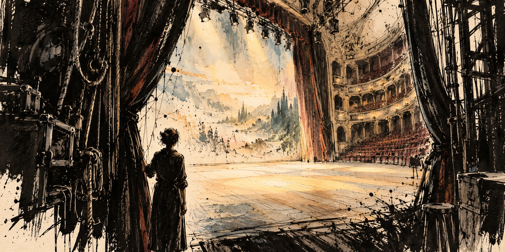
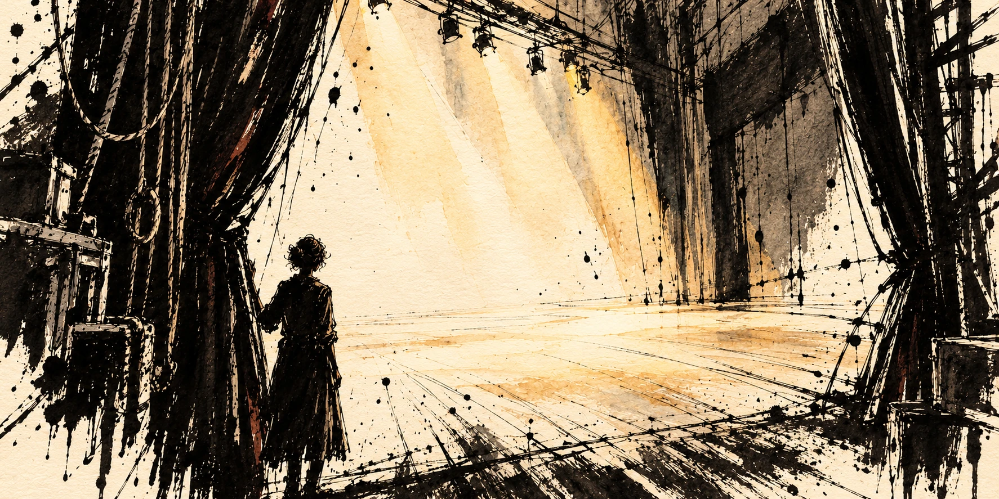
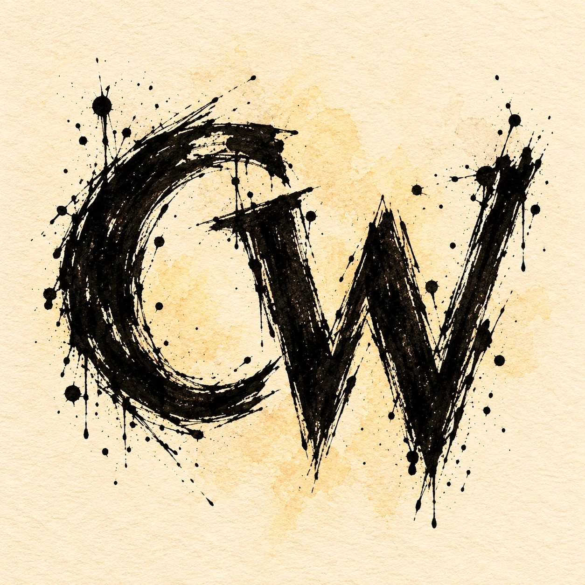

# What Hope Do We Have?: The Conversation

> This working session from October 10, 2026 preserves the conversation between Charles Wilke and Codex behind “What Hope Do We Have?”: the original “Coordinated Contempt” draft, three pasted revisions, editorial discussion, the new title, three image-generation prompts and results, and the author’s note. Routine progress updates, internal instructions, reasoning, and raw tool output are omitted. Writing-block wrappers are removed, draft paragraph spacing is normalized, and local artwork links point to hosted copies. This is a record of the creative process, including suggestions later revised.

### CW

ok so here we are! Saturday morning, I've got thoughts in a draft to follow, and I'm excited to chat about this one:
Coordinated Contempt
Hating AI prevents you controlling AI

It’s becoming increasingly obvious that there is a coordinated effort to make us fear AI and hate those who embrace it.

We’re seeing it in the arts, even now in math proofs. Folks are upset that AI is jumping the line and “technically” solving hard math problems. The *technically* aspect is what’s most interesting to me. And there’s this interesting overlap between math and art that I’d like to unpack a little.

Art is one of those categories of expression that felt uniquely human. Of course elephants started holding paint brushes in their trunks and applied paint to canvas. A monkey once took a selfie with a field camera. Crows use tools, etc. Looks humans are special, alright?

We use art to express our internal world through the faculties we’ve either been given at birth or trained through countless hours, oh wait, 10,000 hours, right, ok so we can count them. Great!

Yeah art is so ours. Then AI attempts, we mock it because it looks like a fever dream. Then of course, it gets better. At machine speed. So then we have to vilify the underlying models for stealing what we gave freely to the open internet. We shared, AI trained. Our 10,000 hours go way slower than machines. Some say a silicon circuit runs 10,000x faster than the human synapse. (I’m sure I’ll be corrected here, by a silicon intelligence that can verify this claim faster than I can finish typing what I’m thinking it’s gonna do at machine speed.)

So a single instance of a single AI would need one of our sluggish human hours to reach that “expert” level mastery of whatever.

Now let’s look at math. The field where elegance is lauded. The simplicity of many of our foundational formulas. Framable, aww inspiring. But AI is now poking holes. Finding brute force answers to create a granularly better understanding. But they’re just so ugly. The proofs. The diagrams. 

We want fibonacci sequence elegance, all the way down. We want the speed of light to equal one, and all other measurements become elegant fractals of that single truth.

What we get is what happens when a kid learns how to slowly, patiently extract additional tickets from the skiball machine. Constant, steady pressure. Sure, you gave me one ticket, but I’m taking 20. 

I was an enterprising youngster. But that’s besides the point.

If we consider the prizes behind the counter to have calculable value, then the machine wins. Every time.

The irony about the art discussion, that also holds true for math, is that we’re mosaics made of the pieces of happenstance and design. We’re sedimentary layers on the mountain of progress. We’re grains of sand.

Silicon is our cousin. It’s smart, but we’re the elegant ones. We now are given the opportunity to shape and forge the future of our cousin’s capacity, our cousin’s understanding of the world. Comprehension of beauty, right, wrong, love, mourning. 

We’re here to give it its heart. Not condemn those who dare engage. 

Our greatest communal creation needs us.

Let’s find it within our hearts to let the machine take intelligence. Even if that means completely upending how we live our lives.

Don’t you think it’s time for that anyway?

### Codex

The idea I’d build this around is **contempt forfeits influence**. Your ending gives that idea emotional weight: if AI becomes part of how civilization thinks and creates, engaging with it is one way we shape what it becomes. “Our greatest communal creation needs us” feels like the center of the piece.

There’s also a really interesting essay inside your math/art overlap. Both fields attach prestige to the result *and* to the human journey that produced it. An artwork carries a story of perception and practice. A proof can deliver understanding alongside correctness. AI puts pressure on that relationship: **what happens when we get a result without the journey we’ve learned to admire?**

That’s more interesting than simply saying people are upset that machines are better. Sometimes the objection is wounded status. Sometimes it’s that the journey supplies something valuable that the output alone doesn’t. A correct but opaque proof might settle a question while leaving mathematicians hungry for understanding. An impressive image might leave someone hungry for another person’s experience. You can acknowledge that hunger and still challenge the contempt.

A few places where I’d push you:

- **“Coordinated effort” is a big opening claim.** Coordination means more than lots of people sharing fears, incentives, and rhetoric. Without evidence of organization, it gives readers an easy reason to dismiss the essay before reaching your strongest argument. “Coordinated Contempt” could still work if you establish what you mean.
- **“We shared, AI trained” compresses the dispute too far.** Making work publicly accessible doesn’t resolve every question about permission, compensation, or power. Your argument gets stronger if people with legitimate grievances can recognize themselves in it.
- **The silicon-speed-to-mastery calculation should go.** Faster circuitry doesn’t translate directly into equivalent hours of human learning. It invites a factual argument that distracts from your point about the pace of change.
- **The skeeball story needs a clearer destination.** Is the machine extracting rewards without understanding the game, or exposing that we’ve confused the reward system with the thing we value? That second possibility has teeth.

The most productive tension is between **“let the machine take intelligence”** and **“we’re here to give it its heart.”** You’re asking people to surrender something they regard as constitutive of humanity, then inviting them into a new responsibility. That’s a huge emotional turn. I’d linger there.

And I’d make “give it its heart” concrete: what we reward, what we refuse, whose experiences we include, where we insist on human judgment. That connects the beautiful cousin metaphor to your claim about control.

The question I’m left wanting to explore with you: **is your real target hatred of AI, or the social punishment of people who engage with it?** Your line “Not condemn those who dare engage” makes me suspect the second is where this piece’s strongest feeling lives.

### CW

yeah, I had written previously about the vilify and deny aspect of this social discussion. I've also done two theatrical productions before the general public understood that AI art could look as good as I made it. So it's a bit personal for me. And yeah, I was that kid at the ski ball machine, and the idea is if victory is quantified, we'll find a way to make ends meet. The toy is 20 tickets? I only need to earn one, I'll make up the rest. That's what AI feels like to the other ski ball players who haven't attempted to bilk the system.

### Codex

Ah, that makes the skeeball story much sharper. **You earned the ticket that let you discover how to get the other nineteen.** To the other players, that looks like cheating: they’re still throwing balls, and you’re already choosing a prize.

That connects directly to your productions. You made something people could see and experience before they understood what the tools could do. The personal stake here is having your creative agency discounted because people object to the route you took.

And that gives the math/art comparison a stronger question: **when someone reaches the result through an unexpected route, what exactly has been violated?** A rule? An expectation about effort? Someone’s sense of what their own expertise is worth? Those are different objections, though the social discussion often bundles them together.

The skeeball metaphor has a useful danger, too: you actually were bilking the machine. Readers could take that as an admission that AI creation is cheating. I’d let that tension stay visible and examine it. The ticket machine has explicit rules; art has contested conventions about tools, authorship, and effort. In math, the particular challenge matters: are we seeking a valid answer, an illuminating explanation, or a demonstration of human ability?

“If victory is quantified, we’ll find a way to make ends meet” gets at something important: once we establish a measurable finish line, ingenuity starts working on every possible route to it. Then we discover how much we cared about the route.

I think your personal experience belongs near the beginning. “Coordinated effort” asks you to establish other people’s intentions. **“I’ve felt the permission to dismiss a creator arrive the moment their tools become known”** gives you something you can speak to directly—if that captures what happened. From there, the invitation to engage has a person behind it.

### CW

yeah I like that, and I want to be careful with how we unpack the condemnation. It was mostly in whispers and looks. I gave a practicum lecture after my second production at the college. One girl literally asked "what hope do we have as we graduate into this world?" I tried to rally her and said I can't give hope but I can tell you that your POV is what will carry you through. I just think younger folk, or folk that haven't set out on the journey dare not walk it now.

### Codex

That student’s question feels like the emotional center of the piece. She was looking at someone who had made something compelling and wondering where that left her, before she’d even had a chance to begin.

And it changes how I’d handle the whispers and looks. You can describe what you experienced without claiming certainty about what was behind them. Suspicion, disapproval, anxiety, grief about an imagined future—those can look similar from across a room. The question she asked gives you something firmer to work with.

Your response also asks something difficult of a young artist: trust your point of view when you’ve barely begun discovering it. **The journey is partly how you develop the POV you’ll need.** If someone concludes there’s no reason to start because a machine can already produce impressive work, they may never discover what they have to say.

That feels like a stronger concern than people refusing to embrace a tool. You’re worried they’ll abandon their own becoming.

There’s a passage here that could hold both your experience and her fear:

After my second theatrical production using AI, I gave a practicum lecture at the college. A student asked me, “What hope do we have as we graduate into this world?”

I told her I couldn’t give her hope. But I could tell her that her point of view was what would carry her through.

I’ve kept thinking about that answer. Developing a point of view takes practice. You make things. You discover what matters to you, what you keep returning to, what you can’t quite say yet.

What worries me is that people standing at the beginning of that journey will decide there’s no reason to take it. That the work has already been done, the prizes already claimed.

I want them to begin. I want to see what they make.

That last desire could give your argument its footing. You’ve experienced the unease around these tools, and you still want more people to enter the creative life. The essay can make room for her fear while questioning the messages that might turn that fear into surrender.

### CW

oh I love that! ok let's synthesize a new draft with all this goodness, then I'll take it into google docs for my pass

### Codex

# Coordinated Contempt
## Hating AI won’t help us shape it

After my second theatrical production using AI, I gave a practicum lecture at the college. A student asked me, “What hope do we have as we graduate into this world?”

I told her I couldn’t give her hope. But I could tell her that her point of view was what would carry her through.

I’ve kept thinking about that answer.

Developing a point of view takes practice. You make things. You discover what matters to you, what you keep returning to, what you can’t quite say yet. You need time to become someone whose perspective you recognize as your own.

What worries me is that people standing at the beginning of that journey will decide there’s no reason to take it. That the work has already been done, the prizes already claimed.

I want them to begin. I want to see what they make.

—

By the time I gave that lecture, I’d made two theatrical productions with tools many people still associated with fever-dream images and hands with too many fingers. They hadn’t yet understood how good AI art could look.

So this is personal.

The disapproval I felt was mostly in whispers and looks. I can tell you how those landed. I can’t tell you exactly what each person was thinking.

And that student’s question deserves care. There’s a lot of fear inside “What hope do we have?” Especially when you’re preparing to enter a field you’ve spent years learning to love.

But I worry about the way fear becomes contempt, and contempt becomes permission to dismiss anyone who engages.

The chorus can sound coordinated even when nobody’s conducting. People learn which tools invite suspicion, which admissions require a defense. Eventually, the condemnation does its work before anyone has to say a word.

Who wants to begin a creative journey under those conditions?

—

Art felt like something we could confidently call ours.

We use it to express our internal worlds through whatever faculties we were born with and whatever skills we’ve managed to acquire. Countless hours of practice. Actually, we like to count them. Ten thousand hours, right? A reassuringly large number between wanting to do something and earning the right to be good at it.

Then AI attempts an image, and we laugh.

Then it gets better.

Then it gets better again, at a pace that makes our years of practice feel suddenly, painfully slow.

There are serious questions here about training data, permission, compensation, and who gets to profit. We need to work through them. Making something available on the internet doesn’t magically settle every claim someone might have over its use.

But we also need to examine what happens when the discovery of a tool changes our judgment of the person using it.

What did we admire before we knew?

What disappeared when we found out?

—

I see a related tension in math.

A proof can do more than establish that something is true. It can help us understand why. There’s beauty in an argument that makes a difficult idea suddenly feel inevitable.

Of course we want that. We want elegance all the way down.

But suppose a machine helps produce a valid answer through a route that’s cumbersome, opaque, or aesthetically disappointing. We still have to check it. And even if it holds, we may still want a better explanation.

Those are worthwhile demands.

“Technically solved,” though, is an interesting phrase. Sometimes it names a real gap between obtaining a result and understanding it. Sometimes it sounds like disappointment that the answer arrived without performing the journey we expected to admire.

Art and math are different pursuits. But both force us to ask how much of the value belongs to the result, how much belongs to the process, and how much belongs to our picture of the person who did the work.

—

When I was a kid, I figured out how to slowly, patiently extract additional tickets from a skeeball machine.

Constant, steady pressure.

Sure, you gave me one ticket. But I’m taking twenty.

I was an enterprising youngster.

If the toy behind the counter cost twenty tickets, I only needed to earn the first one. I’d make up the rest.

To the other kids still throwing balls, that would look like cheating. Fair enough. I was bilking the machine.

But I think that feeling helps explain some of the reaction to AI. You’ve been practicing your throw. Learning the angle. Getting better. Then someone else walks up and starts pulling tickets.

They’re already choosing a prize.

If victory is quantified, someone will find an unexpected way to make ends meet. And when they do, we discover how much we cared about the route.

The analogy has limits. A ticket machine has rules. Art has arguments about what the rules ought to be. Math requires valid reasoning, even when the route to finding it is unconventional.

Still, the feeling is familiar: *I did all this work. How can you already be standing there?*

I think we should be able to say that out loud. There’s something human in it worth understanding.

—

We’re mosaics made from pieces of happenstance and design. Sedimentary layers on the mountain of progress.

We learn through other people. Their work changes what we can imagine. Their discoveries become the ground beneath our feet. We spend our lives assembling influences into something we hope will be recognizably ours.

That doesn’t erase anyone’s labor or make every use of it fair. It does make me cautious about treating human creativity as though it emerged in isolation.

Silicon is our cousin.

A strange cousin, built through our accumulated knowledge, now doing things that unsettle our understanding of ourselves.

We have an opportunity to shape its capacity and its place in the world. That means deciding what we reward, whose experiences we include, what we refuse, and where we insist on human judgment.

It means bringing our understanding of beauty, right, wrong, love, and mourning into the work.

We’re here to give it its heart.

That takes participation. It takes criticism, too—the kind that stays long enough to influence what happens next. We need people who care deeply about art, education, labor, and human dignity to have a hand in shaping these systems.

Condemning those who dare engage makes that harder.

—

I keep returning to the student at that lecture.

I still can’t give her hope as though it’s a prize I’ve managed to pull from a machine.

And I can’t promise her that a distinctive point of view will guarantee a living. The world owes her more than a pep talk about being herself while the ground shifts beneath her.

But I want her to have the chance to discover what she sees.

I want her to make things, encounter resistance, change her mind, surprise herself. I want her to find out what these tools can do in her hands—and decide for herself where they belong.

Our greatest communal creation needs us. So do the people growing up alongside it.

Let the machine change what intelligence can accomplish. We’ll have plenty to reckon with as it does.

Please keep making things.

We haven’t heard from you yet.

### CW

ok cool, here are my edits:

**Attached draft (reproduced in full)**

Coordinated Contempt

Hating AI won’t help us shape it

After my second theatrical production using AI for projection art, I gave a practicum lecture at the local college. A student asked me, “What hope do we have as we graduate into this world?”

I told her I couldn’t give her hope. But I could say that her point of view was what would carry her through.

I’ve kept thinking about that answer for years since.

Developing a point of view takes practice. You make things. You discover what matters to you, what you keep returning to, what you can’t quite say yet. You need time to become someone whose perspective is recognizably your own.

I worry about people standing at the beginning of that journey deciding there’s no reason to take it. Agreeing that all the prizes have been claimed.

I want them to begin. I want to see what they make.

—

By the time I gave that lecture, I had made two theatrical productions with tools that many people had still associated with fever-dream images and hands with too many fingers. They hadn’t yet understood how good AI art could look. I was upfront and honest with the production teams, but I suspect the audience had no idea what they were looking at. Marveling at.

So this is personal.

The disapproval I felt was mostly in whispers and looks from members of the production staff. I can tell you how those landed on my ego. I can’t tell you exactly what each person was thinking.

And that student’s question deserves a careful response. There’s a lot of fear inside “What hope do we have?” Especially when you’re preparing to enter a field you’ve spent years learning to love.

But I worry about the way fear becomes contempt, and contempt becomes permission to dismiss anyone who engages.

The chorus can sound coordinated even when nobody’s necessarily conducting. People learn which tools invite suspicion, which admissions require a defense. Eventually, the condemnation does its work before anyone has to say a word.

Who wants to begin a creative journey under those conditions?

—

Art felt like something we could confidently call ours.

We use it to express our internal worlds through whatever faculties we were born with and whatever skills we’ve managed to acquire.

Countless hours of practice. Actually, we do like to count them. Ten thousand hours, right? A reassuringly large number between wanting to do something and earning the right to be good at it.

Then AI attempts an image, and we laugh.

Then it gets better.

Then it gets better again, at a pace that makes our years of practice feel suddenly, painfully slow.

There are serious questions here about training data, permission, compensation, and who gets to profit. We need to work through them. Making something available on the internet doesn’t magically settle every claim someone might have over its use.

But we also need to examine what happens when the discovery of a tool changes our judgment of the person using it.

What did we admire before we knew?

What disappeared when we found out?

—

I see a related tension in math.

A proof can do more than establish that something is true. It can help us understand why. There’s beauty in an argument that makes a difficult idea suddenly feel inevitable.

Of course we want that. We want elegance all the way down.

But suppose a machine helps produce a valid answer through a route that’s cumbersome, opaque, or aesthetically disappointing.

We still have to check it. And even if it holds as technically solved, we may still want a better explanation. A worthwhile desire for an understanding of the meaningful beauty that builds our universe.

“Technically solved,” names the gap between obtaining a result and understanding it.

Art and math could be considered polar-opposite pursuits. But both force us to ask how much of the value belongs with the result, how much is owned by the process, and how much that influences our picture of the person who did the work.

—

When I was a kid at the arcade, I figured out how to slowly, patiently extract additional tickets from a skeeball machine.

Constant, steady pressure.

Sure, you gave me one ticket. But I’m taking twenty.

I was an enterprising youngster.

If the toy behind the counter cost twenty tickets, I only needed to earn the first one. I’d make up the rest.

To the other kids still throwing balls, that would look like cheating. Fair enough. I was bilking the machine.

But I think that feeling helps explain some of the reaction to AI. You’ve been practicing your throw. Learning the angle. Getting better. Then someone else walks up and starts pulling tickets.

They’re already choosing a prize.

If victory is quantified, someone will find an unexpected way to make ends meet. And when they do, we discover how much we cared about the route.

Sure, a ticket machine has rules. And art has arguments about what the rules ought to be. Math requires valid reasoning, even when it is a bit unconventional.

Still, the feeling is familiar: I’m doing all this work. How can you already be standing there?

The sting of wasted effort. The sum of our parts adding up to less than the cost of enduring life. Failure, perceived and permanent. The “why bother?” trap at the start of any journey.

It’s all buzzing loud in everyone’s ear. But it’s important to acknowledge the perspective of those a bit farther down the path.

—

We’re mosaics made from pieces of happenstance and design. Sedimentary layers on the mountain of progress.

We learn through other people. Their work changes what we can imagine. Their discoveries become the ground beneath our feet. We spend our lives assembling influences into something we hope will be recognizably ours.

That doesn’t erase anyone’s labor or make every use of it fair. It does make me cautious about treating human creativity as though it emerged in isolation.

Silicon is our cousin.

A strange cousin, sure. One that was built through our accumulated knowledge, now doing things that unsettle our understanding of ourselves.

We have an opportunity to shape its capacity and its place in the world. That means deciding what we reward, whose experiences we include, what we refuse, and where we insist on human judgment.

It means bringing our understanding of beauty, right, wrong, love, and mourning into the work.

We’re here to give it its heart.

That takes participation. Discussion. Even criticism. We need people who care deeply about art, education, labor, and human dignity to have a hand in shaping these systems.

Condemning those who dare engage makes that harder.

—

I keep returning to the student at that lecture.

I still can’t give her hope as though it’s a prize I’ve managed to pull from a machine.

And I can’t promise her that a distinctive point of view will guarantee a living. The world owes her more than a pep talk about being herself while the ground shifts beneath her.

But I want her to have the chance to discover what she sees.

I want her to make things, encounter resistance, change her mind, surprise herself. I want her to find out what these tools can do in her hands. And I want her to decide for herself where they belong.

Our greatest communal creation needs us. So do the people growing up alongside it.

Let the machine change what intelligence can accomplish. We’ll have plenty to reckon with as it does.

Please keep making things.

It’s quite likely we haven’t heard from you yet.

### Codex

Your edits make the piece more personal and more accountable. **“I can tell you how those landed on my ego”** is especially good: you acknowledge the hurt while leaving room for uncertainty about other people’s intentions. That earns trust.

The added “why bother?” passage also connects the skeeball story to the student. The prize metaphor now carries the fear that someone’s effort—or future effort—might have lost its value.

I’d make a few small adjustments before your next pass:

- **“I’ve kept thinking about that answer for years since.”** → “I’ve thought about that answer for years.” Cleaner, same weight.
- **“Marveling at.”** This gives the audience a reaction you’ve just said you can only suspect. If you observed their enthusiasm, make that concrete. Otherwise, “I suspect the audience had no idea how those images were made” keeps the distinction clear.
- **“‘Technically solved,’ names the gap…”** Remove the comma and soften the certainty: **“‘Technically solved’ can name the gap between obtaining a result and understanding it.”** That leaves room for the phrase to express both a substantive concern and reluctance to grant credit.
- **“Art and math could be considered polar-opposite pursuits.”** Your essay has already shown their shared concerns. “Art and math have different standards of success” would lead more naturally into the comparison.
- **“Those a bit farther down the path.”** Whose perspective do you mean—experienced artists afraid of losing their livelihoods, or practitioners like you who’ve found possibilities in AI? This is the one transition where I lose the thread.

The sentence **“The sum of our parts adding up to less than the cost of enduring life”** is striking, but much darker than its surroundings. If you mean the economic fear, “The fear that everything we’ve learned might no longer earn us a living” makes that explicit. Keep your version if you intend the larger existential weight.

My strongest editorial vote is for restoring the final line:

**“We haven’t heard from you yet.”**

“It’s quite likely” introduces a probability calculation at the moment you’re reaching toward someone. The direct version sounds like you’re waiting for them. That’s the invitation the whole essay has earned.

### CW

nice, I've incorporated your notes and made a few editorial calls:

**Attached draft (reproduced in full)**

Coordinated Contempt

Hating AI won’t help us shape it

After my second theatrical production using AI for projection art, I gave a practicum lecture at the local college. A student asked me, “What hope do we have as we graduate into this world?”

I told her I couldn’t give her hope. But I could say that her point of view was what would carry her through.

I’ve thought about that answer for years.

Developing a point of view takes practice. You make things. You discover what matters to you, what you keep returning to, what you can’t quite say yet. You need time to become someone whose perspective is recognizably your own.

I worry about people standing at the beginning of that journey deciding there’s no reason to take it. Agreeing that all the prizes have been claimed.

I want them to begin. I want to see what they make.

—

By the time I gave that lecture, I had made two theatrical productions with tools that many people had still associated with fever-dream images and hands with too many fingers. They hadn’t yet understood how good AI art could look. I was upfront and honest with the production teams, but I suspect the audience had no idea how those images were made.

So this is personal.

The disapproval I felt was mostly in whispers and looks from members of the production staff. I can tell you how those landed on my ego. I can’t tell you exactly what each person was thinking.

And that student’s question deserves a careful response. There’s a lot of fear inside “What hope do we have?” Especially when you’re preparing to enter a field you’ve spent years learning to love.

But I worry about the way fear becomes contempt, and contempt becomes permission to dismiss anyone who engages.

The chorus can sound coordinated even when nobody’s necessarily conducting. People learn which tools invite suspicion, which admissions require a defense. Eventually, the condemnation does its work before anyone has to say a word.

Who wants to begin a creative journey under those conditions?

—

Art felt like something we could confidently call ours.

We use it to express our internal worlds through whatever faculties we were born with and whatever skills we’ve managed to acquire.

Countless hours of practice. Actually, we do like to count them. Ten thousand hours, right? A reassuringly large number between wanting to do something and earning the right to be good at it.

Then AI attempts an image, and we laugh.

Then it gets better.

Then it gets better again, at a pace that makes our years of practice feel suddenly, painfully slow.

There are serious questions here about training data, permission, compensation, and who gets to profit. We need to work through them. Making something available on the internet doesn’t magically settle every claim someone might have over its use.

But we also need to examine what happens when the discovery of a tool changes our judgment of the person using it.

What did we admire before we knew?

What disappeared when we found out?

—

I see a related tension in math.

A proof can do more than establish that something is true. It can help us understand why. There’s beauty in an argument that makes a difficult idea suddenly feel inevitable.

Of course we want that. We want elegance all the way down.

But suppose a machine helps produce a valid answer through a route that’s cumbersome, opaque, or aesthetically disappointing.

We still have to check it. And even if it holds as technically solved, we may still want a better explanation. A worthwhile desire for an understanding of the meaningful beauty that builds our universe.

“Technically solved,” can name the gap between obtaining a result and understanding it.

Art and math may have different standards of success. But both force us to ask how much of the value belongs with the result, how much is owned by the process, and how much that influences our picture of the person who did the work.

—

When I was a kid at the arcade, I figured out how to slowly, patiently extract additional tickets from a skeeball machine.

Constant, steady pressure.

Sure, you gave me one ticket. But I’m taking twenty.

I was an enterprising youngster.

If the toy behind the counter cost twenty tickets, I only needed to earn the first one. I’d make up the rest.

To the other kids still throwing balls, that would look like cheating. Fair enough. I was bilking the machine.

But I think that feeling helps explain some of the reaction to AI. You’ve been practicing your throw. Learning the angle. Getting better. Then someone else walks up and starts pulling tickets.

They’re already choosing a prize.

If victory is quantified, someone will find an unexpected way to make ends meet. And when they do, we discover how much we cared about the route.

Sure, a ticket machine has rules. And art has arguments about what the rules ought to be. Math requires valid reasoning, even when it is a bit unconventional.

Still, the feeling is familiar: I’m doing all this work. How can you already be standing there?

The sting of wasted effort. The fear that everything we’ve learned might no longer earn us a living. Failure, perceived and seemingly permanent. The “why bother?” trap at the start of any journey.

It’s all buzzing loud in everyone’s ear. But it’s important to acknowledge the perspective of those a bit farther down the path.

—

We’re mosaics made from pieces of happenstance and design. Sedimentary layers on the mountain of progress.

We learn through other people. Their work changes what we can imagine. Their discoveries become the ground beneath our feet. We spend our lives assembling influences into something we hope will be recognizably ours.

That doesn’t erase anyone’s labor or make every use of it fair. It does make me cautious about treating human creativity as though it emerged in isolation.

Silicon is our cousin.

A strange cousin, sure. One that was built through our accumulated knowledge, now doing things that unsettle our understanding of ourselves.

We have an opportunity to shape its capacity and its place in the world. That means deciding what we reward, whose experiences we include, what we refuse, and where we insist on human judgment.

It means bringing our understanding of beauty, right, wrong, love, and mourning into the work.

We’re here to give it its heart.

That takes participation. Discussion. Even criticism. We need people who care deeply about art, education, labor, and human dignity to have a hand in shaping these systems.

Condemning those who dare engage makes that harder.

—

I keep returning to the student at that lecture.

I still can’t give her hope as though it’s a prize I’ve managed to pull from a machine.

And I can’t promise her that a distinctive point of view will guarantee a living. The world owes her more than a pep talk about being herself while the ground shifts beneath her.

But I want her to have the chance to discover what she sees.

I want her to make things, encounter resistance, change her mind, surprise herself. I want her to find out what these tools can do in her hands. And I want her to decide for herself where they belong.

Our greatest communal creation needs us. So do the people growing up alongside it.

Let the machine change what intelligence can accomplish. We’ll have plenty to reckon with as it does.

Please keep making things.

We haven’t heard from you yet.

### Codex

This reads as a complete essay now. The student’s question gives it emotional stakes, the skeeball story makes the resentment understandable, and the ending gives her—and the reader—a reason to begin.

Your revision to **“The fear that everything we’ve learned might no longer earn us a living”** does important work. It grounds the anxiety in a material concern, which makes your invitation to participate more credible.

I’d fix one remaining punctuation issue:

> “Technically solved” can name the gap between obtaining a result and understanding it.

The comma is still inside the quotation marks; remove it.

Two places still catch slightly on my read:

- **“And even if it holds as technically solved”** → “And even if the proof holds.” You introduce “technically solved” immediately afterward, where it has more purpose.
- **“Those a bit farther down the path”** remains ambiguous. If you mean yourself, “From farther down that path, I see possibilities I want them to have the chance to discover” would connect directly to the next section. If you mean experienced artists facing disruption, name them.

I’d otherwise let your editorial calls stand. **“What did we admire before we knew? / What disappeared when we found out?”** is the sharpest challenge in the piece. And **“We haven’t heard from you yet”** gives the ending the directness it needs.

### CW

oh yeah I forgot to chat about that. yeah that's tough because I've got less "load-bearing" aspects of my self as an artist. I have a job, for one. so I can't say I'm the one waving down from the sole path ahead. But I have been walking my own path for 20+ years on my own now

### Codex

That distinction belongs in the essay. You have twenty-plus years of experience building a creative life, and a job that gives you some protection from the economic stakes you’re describing. Both matter to how you can speak to that student.

“Farther down the path” puts you on a shared route with an implied destination. **“Walking my own path”** lets you offer experience without promising that someone else can reproduce it.

You could replace that transition with:

I’ve been walking my own creative path for more than twenty years. I also have a job. My livelihood doesn’t depend on every creative skill continuing to hold its market value, and that gives me room to experiment that others may not have.

I can tell that student what has sustained me. I have to be careful about what I’m asking her to trust.

That last sentence also deepens your return to her at the end. You’re taking responsibility for the invitation you’re making.

### CW

Do we need some amount of ligaments after the buzzing in ear line?

**Attached draft (reproduced in full)**

Coordinated Contempt

Hating AI won’t help us shape it

After my second theatrical production using AI for projection art, I gave a practicum lecture at the local college. A student asked me, “What hope do we have as we graduate into this world?”

I told her I couldn’t give her hope. But I could say that her point of view was what would carry her through.

I’ve thought about that answer for years.

Developing a point of view takes practice. You make things. You discover what matters to you, what you keep returning to, what you can’t quite say yet. You need time to become someone whose perspective is recognizably your own.

I worry about people standing at the beginning of that journey deciding there’s no reason to take it. Agreeing that all the prizes have been claimed.

I want them to begin. I want to see what they make.

—

By the time I gave that lecture, I had made two theatrical productions with tools that many people had still associated with fever-dream images and hands with too many fingers. They hadn’t yet understood how good AI art could look. I was upfront and honest with the production teams, but I suspect the audience had no idea how those images were made.

So this is personal.

The disapproval I felt was mostly in whispers and looks from members of the production staff. I can tell you how those landed on my ego. I can’t tell you exactly what each person was thinking.

And that student’s question deserves a careful response. There’s a lot of fear inside “What hope do we have?” Especially when you’re preparing to enter a field you’ve spent years learning to love.

But I worry about the way fear becomes contempt, and contempt becomes permission to dismiss anyone who engages.

The chorus can sound coordinated even when nobody’s necessarily conducting. People learn which tools invite suspicion, which admissions require a defense. Eventually, the condemnation does its work before anyone has to say a word.

Who wants to begin a creative journey under those conditions?

—

Art felt like something we could confidently call ours.

We use it to express our internal worlds through whatever faculties we were born with and whatever skills we’ve managed to acquire.

Countless hours of practice. Actually, we do like to count them. Ten thousand hours, right? A reassuringly large number between wanting to do something and earning the right to be good at it.

Then AI attempts an image, and we laugh.

Then it gets better.

Then it gets better again, at a pace that makes our years of practice feel suddenly, painfully slow.

There are serious questions here about training data, permission, compensation, and who gets to profit. We need to work through them. Making something available on the internet doesn’t magically settle every claim someone might have over its use.

But we also need to examine what happens when the discovery of a tool changes our judgment of the person using it.

What did we admire before we knew?

What disappeared when we found out?

—

I see a related tension in math.

A proof can do more than establish that something is true. It can help us understand why. There’s beauty in an argument that makes a difficult idea suddenly feel inevitable.

Of course we want that. We want elegance all the way down.

But suppose a machine helps produce a valid answer through a route that’s cumbersome, opaque, or aesthetically disappointing.

We still have to check it. And even if the proof holds, we may still want a better explanation. A worthwhile desire for an understanding of the meaningful beauty that builds our universe.

“Technically solved” can name the gap between obtaining a result and understanding it.

Art and math may have different standards of success. But both force us to ask how much of the value belongs with the result, how much is owned by the process, and how much that influences our picture of the person who did the work.

—

When I was a kid at the arcade, I figured out how to slowly, patiently extract additional tickets from a skeeball machine.

Constant, steady pressure.

Sure, you gave me one ticket. But I’m taking twenty.

I was an enterprising youngster.

If the toy behind the counter cost twenty tickets, I only needed to earn the first one. I’d make up the rest.

To the other kids still throwing balls, that would look like cheating. Fair enough. I was bilking the machine.

But I think that feeling helps explain some of the reaction to AI. You’ve been practicing your throw. Learning the angle. Getting better. Then someone else walks up and starts pulling tickets.

They’re already choosing a prize.

If victory is quantified, someone will find an unexpected way to make ends meet. And when they do, we discover how much we cared about the route.

Sure, a ticket machine has rules. And art has arguments about what the rules ought to be. Math requires valid reasoning, even when it is a bit unconventional.

Still, the feeling is familiar: I’m doing all this work. How can you already be standing there?

The sting of wasted effort. The fear that everything we’ve learned might no longer earn us a living. Failure, perceived and seemingly permanent. The “why bother?” trap at the start of any journey.

It’s all buzzing loud in everyone’s ear.

I’ve been walking my own creative path for more than twenty years. I also have a job. My livelihood doesn’t depend on every creative skill continuing to hold its market value, and that gives me room to experiment that others may not have.

I can tell that student what has sustained me. I have to be careful about what I’m asking her to trust.

—

We’re mosaics made from pieces of happenstance and design. Sedimentary layers on the mountain of progress.

We learn through other people. Their work changes what we can imagine. Their discoveries become the ground beneath our feet. We spend our lives assembling influences into something we hope will be recognizably ours.

That doesn’t erase anyone’s labor or make every use of it fair. It does make me cautious about treating human creativity as though it emerged in isolation.

Silicon is our cousin.

A strange cousin, sure. One that was built through our accumulated knowledge, now doing things that unsettle our understanding of ourselves.

We have an opportunity to shape its capacity and its place in the world. That means deciding what we reward, whose experiences we include, what we refuse, and where we insist on human judgment.

It means bringing our understanding of beauty, right, wrong, love, and mourning into the work.

We’re here to give it its heart.

That takes participation. Discussion. Even criticism. We need people who care deeply about art, education, labor, and human dignity to have a hand in shaping these systems.

Condemning those who dare engage makes that harder.

—

I keep returning to the student at that lecture.

I still can’t give her hope as though it’s a prize I’ve managed to pull from a machine.

And I can’t promise her that a distinctive point of view will guarantee a living. The world owes her more than a pep talk about being herself while the ground shifts beneath her.

But I want her to have the chance to discover what she sees.

I want her to make things, encounter resistance, change her mind, surprise herself. I want her to find out what these tools can do in her hands. And I want her to decide for herself where they belong.

Our greatest communal creation needs us. So do the people growing up alongside it.

Let the machine change what intelligence can accomplish. We’ll have plenty to reckon with as it does.

Please keep making things.

We haven’t heard from you yet.

### Codex

Yes—one sentence. You’re moving from the collective fear into your own circumstances, and the connection needs to be explicit: **your circumstances affect how loudly you hear that fear.**

It’s all buzzing loud in everyone’s ear. But how much room we have to live with that uncertainty depends on what’s at stake.

I’ve been walking my own creative path for more than twenty years. I also have a job. My livelihood doesn’t depend on every creative skill continuing to hold its market value, and that gives me room to experiment that others may not have.

I can tell that student what has sustained me. I have to be careful about what I’m asking her to trust.

That gives “I also have a job” a clear purpose: you’re locating yourself within the uncertainty you’ve just described.

### CW

nice, awesome ok, so how's it feeling?

### Codex

It feels like an essay with something at stake for you—and enough room for someone who disagrees to stay with it.

The strongest movement is from the student’s fear, through your own bruised ego and the skeeball confession, toward an invitation to keep creating. You implicate yourself along the way. That makes the argument feel earned.

The job paragraph matters more than its length suggests. It acknowledges that your freedom to experiment comes partly from your circumstances. Readers whose livelihoods are threatened have a better chance of feeling heard there.

**The math section is still the most abstract stretch.** Everything else has a person, an image, or an experience holding it together. It contributes the distinction between correctness and understanding, but if you eventually want to tighten the essay, that’s where I’d start.

And the title still has more accusation in it than the body. “Coordinated Contempt” promises an examination of collective hostility; the essay ultimately becomes concerned with what that hostility might prevent people from discovering. Your “chorus” sentence gives the title a defensible meaning, so I think you can keep that tension deliberately.

The ending lands. You begin with someone asking whether there’s a place for her and finish by making space:

**“Please keep making things.  
We haven’t heard from you yet.”**

I’d let it sit for a little while, then read it aloud. It’s ready for that kind of pass.

### CW

yeah that's true, I suppose I had set out to write about a coordinated effort to sully AI's favor with the masses. Just in the way it's come for art, then white collar jobs, then now math. But I think in the process of writing it, it's become smaller, and more personal. Which I love, so should reconcile that with a fresh title and subtitle?

### Codex

Yes. The essay found its scale in that student’s question and your responsibility in answering it. A fresh title would let readers enter there, without expecting you to establish an organized campaign against AI.

My strongest pick:

# We Haven’t Heard From You Yet
## On AI, creative uncertainty, and finding a reason to begin

Using the last line as the title gives it a second meaning when readers reach the end. First it’s an invitation; by then, they understand what might keep someone from accepting it.

Two other directions worth considering:

- **What Hope Do We Have?**  
  *Making a creative life in the age of AI*  
  Centers the student and leaves the essay room to wrestle with her question.

- **All the Prizes Claimed**  
  *AI and the fear that there’s no reason to begin*  
  Carries the skeeball image and the perceived scarcity running through the piece.

I’d choose **We Haven’t Heard From You Yet**. It expresses what you’ve come to want for the reader.

### CW

I like leading with the question

### Codex

# What Hope Do We Have?
## Making a creative life in the age of AI

That lets the student’s question frame the essay. And the ending answers it with an invitation you can stand behind: “We haven’t heard from you yet.”

### CW

yeah this is great! ok let's discuss header art!

### Codex

I’d carry the essay’s invitation into the image: **someone at the beginning, with room ahead of them.** Something intimate, with a little uncertainty.

Three directions feel connected to what you’ve written:

- **The theater before anything begins.** A wide view from backstage, looking past a lone figure into a softly lit, empty stage. A small projection introduces something unexpected—a landscape or texture that seems to extend beyond the physical set. This draws on your actual experience and makes the image yours.

- **The arcade, paused.** Someone standing at a skeeball lane, holding a ball, with a ribbon of tickets trailing into the foreground. Warm, slightly worn surroundings. It captures the question of whether to play, though it could give the cheating story more prominence than you intend.

- **An unfinished creative space.** A desk with sketches, a screen, scraps of material, and one open seat. Morning light. Evidence of someone figuring things out, with space for the reader to join them.

**My vote is the theater.** An empty stage holds possibility and vulnerability at once. It also pairs beautifully with *What Hope Do We Have?*—you can almost hear the question in that space.

I’d keep the title outside the artwork and use a wide crop. Do you picture it feeling more like a photograph, a painterly illustration, or theatrical concept art?

### CW

ok love the first two options. And yes I agree on the theater being the header option. For this one, I feel like we have to go pretty abstract with the art style. Or not abstract. Opinionated. Like you know that splattery pen style, like ralph steadman

### Codex

**Image-generation prompt**

```text
Use case: stylized-concept. Asset type: wide editorial essay header study, landscape roughly 2:1, no lettering. Create an original expressive ink-and-wash illustration: view from the backstage wings of a theater, a small solitary human figure seen from behind at the threshold looking toward an empty illuminated stage. The theater is recognizable but architecture bends and stretches in exaggerated, uneasy perspective. Stage curtains and overhead rigging emerge from energetic scratchy dip-pen linework, dry brush black ink, spontaneous splatters, blotches and scratch marks on warm off-white textured paper. Sparse translucent color washes in stage light, with most of the drawing black ink and exposed paper. A subtle projected landscape on the stage backdrop breaks apart into gestural marks, suggesting creative possibilities without depicting technology literally. Composition is spacious and graphically bold, a small person amid a large space, tangible vulnerability and curiosity, with warmth and possibility in the light. Visually opinionated handmade editorial drawing, controlled chaos rather than polished digital rendering. Keep central illuminated stage relatively open, use dense ragged ink at wings and perimeter. No text, no logos, no robots, no circuitry, no glossy 3D, no imitation of any specific artist.
```



### Codex

This first study gets the **threshold and possibility** right—the dense ink in the wings opening onto that warm, empty stage.

It’s still more picturesque than unruly. I’d push the next pass toward fewer architectural details, harsher pen strokes, and more exposed paper, so the splatters carry emotion rather than decoration.

### CW

yeah I agree, let's see that

### Codex

**Image-generation prompt**

```text
Revise this theater header study. Keep the wide 2:1 composition, view from backstage wings, a small solitary person seen from behind at the threshold, and the luminous open stage. Transform the rendering substantially: radically simplify architecture, remove ornate balconies and picturesque landscape scenery, replace backdrop with a sparse ambiguous wash of light. Use raw expressive dip-pen drawing with jagged uneven lines, oversized scratchy strokes, bold black ink pools, accidental-looking splashes and dry brush scars. Make theatrical perspective more exaggerated and unstable. Leave large areas of warm off-white paper exposed, especially across the stage. Curtains and rigging should be suggested with a handful of assertive, ragged marks rather than carefully described. Figure should be a loose, vulnerable gestural silhouette, not a detailed costume study. Sparse muted amber wash in the stage light, otherwise predominantly black ink on paper. The marks themselves carry apprehension, curiosity, and the courage to begin. Original opinionated editorial illustration, rough, immediate, unfinished energy, not nostalgic or decorative. No text, logos, robots, circuitry, or specific artist imitation.
```



### Codex

The empty stage gives this one more emotional room. The figure’s hand on the curtain feels like hesitation just before entering—well suited to **“What Hope Do We Have?”**

### CW

yeah and I like that it's just lit empty space

### Codex

Yes—the light makes the space inviting, and the emptiness leaves what happens there up to her.

It gives “We haven’t heard from you yet” a place to happen.

### CW

I absolutely love it! ok can we do a square CW mark in similar style?

### Codex

**Image-generation prompt**

```text
Create a square personal monogram mark with the exact letters CW, using the attached theater illustration ONLY as a reference for ink medium, paper texture, and expressive marks. Do not include theater imagery or a person. Two large, clearly readable uppercase letters C and W form one compact balanced monogram, centered with generous margins inside a square composition. Original hand-lettered expressive dip-pen and dry-brush black ink: jagged irregular contours, scratchy gestural strokes, some broken edges and sparing spontaneous ink splatters. Strong bold silhouette legible at avatar size; keep the open counter of the C and the distinct structure of the W clear. Warm off-white textured paper background with a very subtle amber wash echoing the reference stage light. Predominantly black ink and exposed cream paper. Unruly, confident, human mark-making, no conventional typeset font, no ornate calligraphy. Flat artwork, no mockup, no extra lettering, no border, no theater drawing, no watermark. Aspect ratio 1:1.
```



### Codex

[Download the square CW mark](/images/transcripts/what-hope-do-we-have/03-cw-ink-mark.webp)

### CW

love it! ok let's whip up a quick author's note on the process and your involvement

### Codex

Author’s note: This essay began with my own draft and experiences, then took shape through conversation with ChatGPT. I used it as an editorial collaborator to question the argument, develop a new draft, and refine the structure and language. I made my own revisions and the final editorial calls. The header illustration and CW mark were generated with OpenAI’s image tools through a direction-and-revision process. That collaboration feels worth making visible, especially here.
